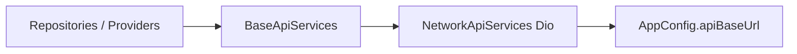

# API and environment

Backend URLs, configuration, and network layer for CTS.

**See also:** [ARCHITECTURE.md](./ARCHITECTURE.md) · [BUILD_AND_RELEASE.md](./BUILD_AND_RELEASE.md)

---

## Configuration files

| File | Purpose |
|------|---------|
| `.env.example` | Template — copy to `.env` |
| `.env` | Local overrides (gitignored — do not commit secrets) |
| `pubspec.yaml` | Lists `.env` as asset for `flutter_dotenv` |

Load path: `AppConfig.initialize()` in `lib/appManager/app_class.dart` (via `main.dart`).

---

## Environment variables

| Variable | Required | Description |
|----------|----------|-------------|
| `API_BASE_URL` | Recommended | REST base URL, trailing `/` optional |
| `BASE_URL` | Legacy alias | Used if `API_BASE_URL` empty |
| `WEBSOCKET_URL` | Recommended | D2D WebSocket base (e.g. `ws://host/ws/`) |
| `DEFAULT_ADMIN_CODE` | Optional | Default admin registration code |

**Defaults (if .env missing):** `http://172.20.10.2/` and `ws://172.20.10.2/ws/` — suitable for LAN dev only.

**Normalization:** `https://` → `http://`, `wss://` → `ws://` (debug logs when conversion happens).

---

## Network stack

| File | Role |
|------|------|
| `lib/core/network/network_api_services.dart` | Concrete API client |
| `lib/core/network/dio_factory.dart` | Dio setup |
| `lib/core/network/base_api_services.dart` | Abstract API surface |
| `lib/core/network/connectivity_service.dart` | Online/offline detection |

Repositories receive `BaseApiServices` from Provider DI.

---

## API results

Shared pattern: `ApiResult<T>` (`lib/api/api_result.dart`) — `isSuccess`, `data`, error message.

UI maps failures to `ViewState.error` and snackbars via `SnackBarService`.

---

## Session and auth

- **AuthenticationRepositoryImpl** — login/signup API calls
- **SessionRepositoryImpl** — persisted login flag and user type for routing
- Cookies / tokens: follow implementation in auth + session data layer (secure storage where used)

Logout clears session and resets in-memory controllers.

---

## WebSocket (D2D)

- URL from `AppConfig.instance.webSocketUrl`
- **D2dChannelProvider** — connect/disconnect per `batchId`
- Used by admin **D2dChannel** and driver **D2DLogScreen**

Ensure backend WebSocket path matches `WEBSOCKET_URL` and batch id format expected by server.

---

## Security checklist (production)

- [ ] Use HTTPS and WSS in production `.env`
- [ ] Remove cleartext exceptions except dev builds
- [ ] Do not commit `.env` with production credentials
- [ ] Rotate admin codes; avoid shipping `DEFAULT_ADMIN_CODE` in public builds
- [ ] Validate certificate pinning if required by security policy (not in app today)

---

## Local development tips

1. Find host machine IP on Wi‑Fi (not `localhost` on physical device)
2. Set `API_BASE_URL=http://<ip>/` and matching `WEBSOCKET_URL`
3. Ensure phone and PC on same network; firewall allows connections
4. Android cleartext: may require network security config for HTTP dev

---

## Related legacy / duplicate paths

- `lib/api/` may re-export `core/network` — prefer `package:cts/core/network/...` in new code
