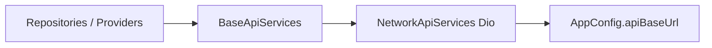

> **Doc:** docs/API_AND_ENV.md
> **Updated:** 2026-08-20 22:15 IST
> **Session:** Verified unchanged

# API and environment

Backend URLs, configuration, and network layer for CTS.

**See also:** [ARCHITECTURE.md](./ARCHITECTURE.md) · [BUILD_AND_RELEASE.md](./BUILD_AND_RELEASE.md) · **endpoint catalog:** [API_CONTRACTS.md](./API_CONTRACTS.md)

---

## Configuration files

| File | Purpose |
|------|---------|
| `.env.example` | Template — copy to `.env` |
| `.env` | Local overrides (gitignored — do not commit secrets) |
| `pubspec.yaml` | Lists `.env` as asset for `flutter_dotenv` |

Load path: `AppConfig.initialize()` in `lib/appManager/app_class.dart` (via `main.dart`).

---

## Environment variables

| Variable | Required | Description |
|----------|----------|-------------|
| `API_BASE_URL` | Recommended | REST base URL, trailing `/` optional |
| `BASE_URL` | Legacy alias | Used if `API_BASE_URL` empty |
| `WEBSOCKET_URL` | Recommended | D2D WebSocket base (`ws://host/ws/` locally, `wss://…` in production) |
| `DEFAULT_ADMIN_CODE` | Optional | Default admin registration code |

**Defaults (if .env missing):** `http://172.20.10.2/` and `ws://172.20.10.2/ws/` — suitable for LAN dev only.

**Normalization:** trailing `/` only. Schemes are **not** rewritten — `https://` and `wss://` stay as set.

Android **debug/profile** allow cleartext HTTP for LAN Docker. **Release** does not (`usesCleartextTraffic` is not set on the main manifest).

---

## Network stack

| File | Role |
|------|------|
| `lib/api/network_api_services.dart` | Concrete API client (Dio) |
| `lib/api/logging_interceptor.dart` | Dio logging |
| `lib/api/base_api_services.dart` | Abstract API surface |
| `lib/api/connectivity_service.dart` | Online/offline detection |

Repositories receive `BaseApiServices` from Provider DI.

---

## API results

Shared pattern: `ApiResult<T>` (`lib/api/api_result.dart`) — `isSuccess`, `data`, error message.

UI maps failures to `ViewState.error` and snackbars via `SnackBarService`.

---

## Session and auth

- **AuthenticationRepositoryImpl** — login API; public sign-up disabled (does not send `userType: ADMIN`)
- **SessionRepositoryImpl** — logged-in requires `isLogin` **and** a non-empty `sessionid` in secure storage
- Cookies: `SessionManager` (FlutterSecureStorage, in-memory after first read). Logout and HTTP 401 always call `AppManager.clearLocalSession()`. Do not add a session ping or extra connectivity probes.

Logout clears secure cookies + prefs even if the logout POST fails, then refreshes `SessionAuthNotifier`.

---

## WebSocket (D2D)

- URL from `AppConfig.instance.webSocketUrl` (see `.env`, not `ApiUrl`)
- **D2dChannelProvider** — `IOWebSocketChannel.connect` with session `Cookie` header
- Used by admin **D2dChannel** and driver **D2DLogScreen**
- Full URL pattern: `ws://<host>/ws/<batchId>/` (or `wss://` in production)
- Close **4401** / **4403** if the session is missing or the role cannot control that batch
- Pre-connect REST: `GET d2d/get_d2d_log_status/<batch_id>` via `D2dRepository` (`ApiUrl.d2dLogStatus`)

Evening return is **not** WebSocket — see [API_CONTRACTS.md](./API_CONTRACTS.md) return-batch REST.

### Docker Desktop backend

- Nginx exposes **port 80** on your PC; Django runs internally on 8000.
- Set `API_BASE_URL=http://<your-ip>/` and `WEBSOCKET_URL=ws://<your-ip>/ws/` (no `:8000`).
- Nginx must proxy WebSocket upgrades (`Upgrade` / `Connection` headers in `nginx.conf`).
- Backend route accepts `/ws/<batch_id>/` and `/ws/<batch_id>`.

Ensure backend WebSocket path matches `WEBSOCKET_URL` and batch id format expected by server.

---

## Security checklist (production)

- [ ] Use HTTPS and WSS in production `.env`
- [x] Cleartext HTTP only on Android debug/profile (release manifest has no `usesCleartextTraffic`)
- [ ] Do not commit `.env` with production credentials
- [ ] Rotate admin codes; avoid shipping `DEFAULT_ADMIN_CODE` in public builds
- [ ] Validate certificate pinning if required by security policy (not in app today)

---

## Local development tips

1. Find host machine IP on Wi‑Fi with `ipconfig` (not `localhost` on physical device)
2. Set `API_BASE_URL=http://<ip>/` and `WEBSOCKET_URL=ws://<ip>/ws/` (Docker uses port 80 via Nginx)
3. Phone **and** emulator: keep the **LAN IP** so both devices share one `.env`. `10.0.2.2` is emulator-only.
4. Ensure phone and PC on same network; firewall allows connections
5. Android HTTP LAN: debug/profile already allow cleartext; release does not

---

## Related legacy / duplicate paths

- Canonical imports: `package:cts/api/...` — there is no `lib/core/network/`
