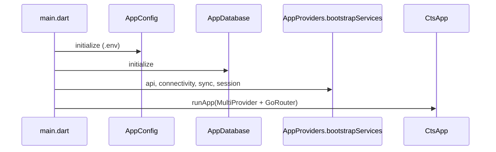
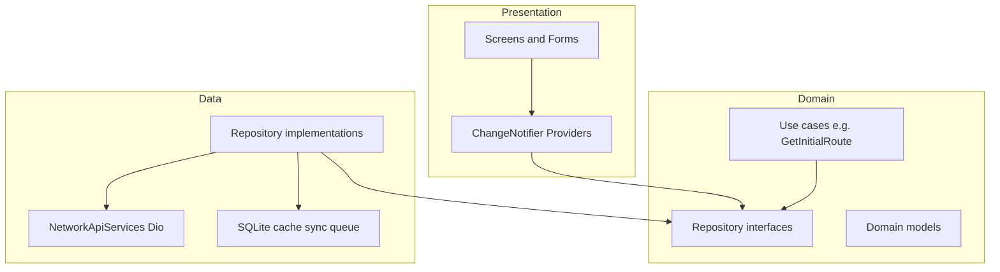

# Architecture

How the CTS (c2s) Flutter app is structured: layers, startup, dependency injection, and data flow.

**See also:** [CODE_MAP.md](./CODE_MAP.md) · [ROUTING_AND_AUTH.md](./ROUTING_AND_AUTH.md) · [FEATURES.md](./FEATURES.md)

---

## Goals

- **Single codebase** for iOS and Android
- **Feature-first** modules under `lib/features/`
- **Clean Architecture** per feature: `data` → `domain` → `presentation`
- **Provider** (`ChangeNotifier`) for app-wide state
- **go_router** for navigation and role guards

---

## Startup sequence

| Step | Code | Responsibility |
|------|------|----------------|
| 1 | `lib/main.dart` | `WidgetsFlutterBinding`, DB init, bootstrap |
| 2 | `AppConfig.initialize()` | `.env` → API / WebSocket URLs |
| 3 | `AppDatabase` / `OfflineTempDatabase` | SQLite for cache, sync queue, offline temp |
| 4 | `AppProviders.bootstrapServices()` | Network, `SyncManager`, offline-first batches, `SessionAuthNotifier` |
| 5 | `CtsApp` | `MaterialApp.router`, theme, global providers |

---

## Layer diagram

---

## `lib/` layout

| Path | Role |
|------|------|
| `lib/app/` | `CtsApp`, `AppTheme`, `createAppRouter`, `AppProviders` |
| `lib/core/network/` | Dio client, connectivity, env helpers |
| `lib/core/sync/` | `SyncManager` — offline mutation queue |
| `lib/features/<name>/` | Feature modules (preferred) |
| `lib/shared/widgets/` | Reusable UI |
| `lib/domain/` | Shared repositories / use cases (auth session) |
| `lib/data/` | Shared data (session, auth impl, local DB) |
| `lib/offline_temp/` | Prototype offline UI + local store (not full production offline) |
| `lib/design/wireframes/` | Debug layout gallery only |
| `lib/appManager/`, `lib/controllers/`, `lib/screens/` | Legacy; many re-export features |

---

## Dependency injection (Provider)

All providers are registered in [`lib/app/di/app_providers.dart`](../lib/app/di/app_providers.dart).

| Kind | Examples |
|------|----------|
| `Provider<T>` | `BaseApiServices`, repositories, use cases |
| `ChangeNotifierProvider` | Feature controllers, `SyncManager`, `SessionAuthNotifier` |
| `ChangeNotifierProvider` (singleton) | Pre-bootstrapped `OfflineFirstBatchRepository`, `SessionAuthNotifier` |

**Pattern:** Screens call `context.read<X>()` in `initState` / actions and `context.watch` / `Consumer` in build.

**Decision (documented in code):** Riverpod deferred; Provider kept for migration cost vs benefit.

---

## Data flow (typical CRUD feature)

1. **Screen** `initState` → `controller.fetchItems()`
2. **Controller** sets `ViewState.loading` → calls **Repository**
3. **Repository** → Dio API (or cache when offline-first)
4. Controller sets `success` / `error`, `notifyListeners()`
5. **UI** `Consumer` rebuilds: skeleton → list or `StatusMessage`
6. **Form** uses separate `*FormProvider` for controllers; submit → controller create/update → `context.pop()`

---

## Offline-first (production scope today)

Only **batches** use full offline-first + sync queue via `OfflineFirstBatchRepository` (see [OFFLINE_AND_SYNC.md](./OFFLINE_AND_SYNC.md)).

Other entities are online-first with standard repositories.

---

## Cross-cutting concerns

| Concern | Location |
|---------|----------|
| UI loading/error states | `ViewState` in `lib/appManager/view_state.dart` |
| Snackbars | `SnackBarService` + global keys |
| Session persistence | `SessionRepositoryImpl`, secure/local storage |
| Auth API | `AuthenticationRepositoryImpl` |
| Controller reset on logout | `ControllerResetUtil` |

---

## Adding a new feature (checklist)

1. Create `lib/features/<name>/` with `data`, `domain`, `presentation`
2. Add repository interface + impl
3. Register `Provider` + `ChangeNotifierProvider`s in `app_providers.dart`
4. Add routes in `route_names.dart` and `app_router.dart`
5. Update [FEATURES.md](./FEATURES.md) and [UI_ARCHITECTURE.md](./UI_ARCHITECTURE.md)
