> **Doc:** docs/FE_PRODUCTION_INSPECTION_CHECKLIST.md  
> **Updated:** 2026-09-12 16:00 IST  
> **Scope:** Frontend only (Flutter CTS / `cts_beta`) — BE inspection is a separate agent  
> **Status:** Inspection **P0–P7 PASS** — next **P8** (device use cases; needs BE + **go**)  
> **Session:** Moved from repo root → `docs/`

# FE Production Inspection Checklist

Checkpoint list for a production-hardening pass, ordered by **system / app / architecture design**, not by random QA themes.

Mark: `[ ]` open · `[~]` in progress · `[x]` done · `[N/A]` not applicable.

**Out of scope:** Django / Postgres / Redis / nginx / WS **server** internals (BE agent).  
**Explicit N/A (this FE prod pass):** Flutter **web/desktop** targets (sqflite / blank-boot — see `AGENTS.md`). Do not spend inspection time on web UI unless product reopens that surface.  
**In scope:** Flutter **iOS/Android** app as a system: actors, containers, layers, data flows, sequences, deployment, India-ops / scale readiness.

**Golden rule for inspection:** Every finding must point at a **diagram element** (actor, container, flow, or sequence step) *or* a **checklist ID**. If code and diagram disagree, fix the weaker one (usually code) and note drift in findings.

---

## A. Design views (read before any phase)

Inspect in this order — each view unlocks the next:

| View | Design lens | Diagram(s) below | Checklist phase |
|------|-------------|------------------|-----------------|
| **V0** | Tooling can see the system | — | **P0** |
| **V1** | System context (who talks to whom) | Fig 1 | **P1** (boundary) |
| **V2** | Containers / modules | Fig 2 | **P1** |
| **V3** | Layer / component (UML-ish) | Fig 3 | **P1**, **P2** |
| **V4** | Actors & use cases | Fig 4 | **P2**, **P8** |
| **V5** | Data flow (DFD L0 / L1) | Fig 5–6 | **P4**, **P9** |
| **V6** | Runtime sequences | Fig 7–10 | **P2**, **P5**, **P8** |
| **V7** | Session / trip state | Fig 11 | **P2**, **P5**, **P8** |
| **V8** | Target vs legacy architecture | Fig 12 | **P3** |
| **V9** | Deployment (devices / stores) | Fig 13 | **P7**, **P10** |
| **V10** | Quality attributes (scale, security) | Fig 5–6, 9 | **P5**, **P9**, **P10** |

```text
V0 tooling
 → V1 context → V2 containers → V3 layers
 → V4 use cases → V5 DFD → V6 sequences → V7 state
 → V8 debt vs target → V9 deploy → V10 quality
```

Phases **P5 ∥ P6** still run in parallel after V3–V6 are understood on paper.

---

## B. Diagrams (SoT for matching code)

### Fig 1 — System context (C4 L1)

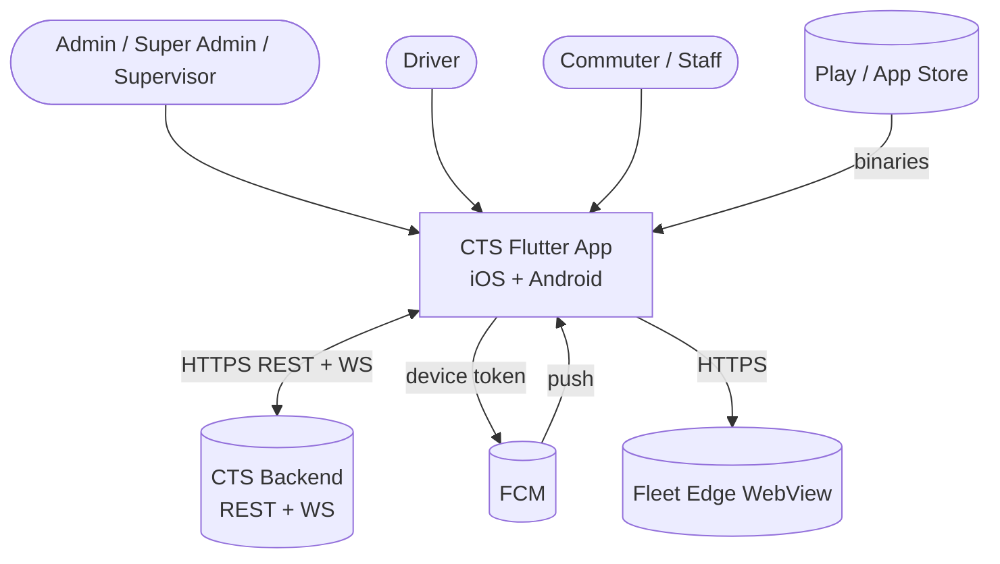

**Inspect:** FE never talks to Postgres/Redis directly. Only `be`, `fcm`, `fleet`, plus on-device SQLite.

**Fig 1b — Short STRIDE on FE trust boundary (P5):**

| Threat | FE question | Checkpoint |
|--------|-------------|------------|
| **S**poofing | Can a deep link or stolen cookie act as another role? | FE-5.8, FE-5.11 |
| **T**ampering | Can cache/sync queue rewrite trip state unnoticed? | FE-4.10, FE-9.7 |
| **R**epudiation | Can support prove who boarded without logging PII forever? | FE-10.12, FE-10.13 |
| **I**nfo disclosure | Photos/QR/WebView/logs leak riders? | FE-5.4, FE-5.7, FE-5.9 |
| **D**enial of service | WS reconnect storm / huge lists freeze mid-tier phones? | FE-9.* |
| **E**levation | Supervisor sees full-admin tiles after new feature? | FE-2.14, FE-8B.9 |

---

### Fig 2 — Containers inside the FE app (C4 L2)

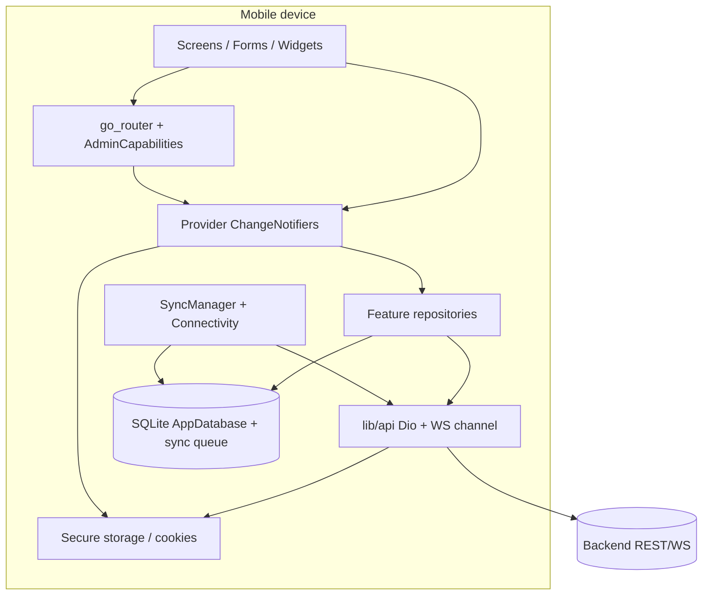

**Inspect (P1):** every feature module plugs into `UI → SM → REPO → API|LOCAL`. Exceptions listed in findings.

---

### Fig 3 — Layer / component (UML-style)

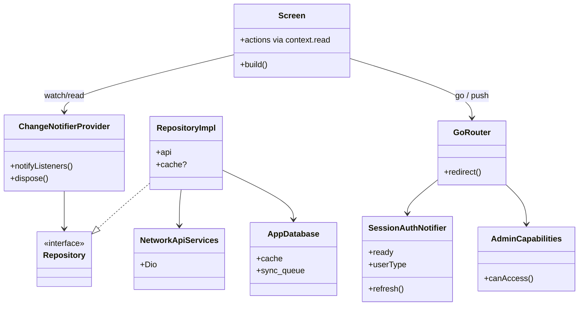

**Inspect:** no Screen → Dio; no Provider holding raw BuildContext across async without `mounted`.

---

### Fig 4 — Use cases by actor

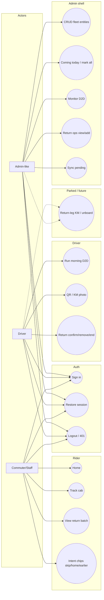

| Use case | Static map | Device proof | Notes |
|----------|------------|--------------|-------|
| UC1–UC3 | P2 | P8A | |
| UC4–UC8 | P2 | P8B | |
| UC9–UC11 | P2 | P8C | |
| UC12–UC14 | P2 | P8D | |
| UC15 | P2 | P8D | Commuter intent chips — confirm still product or mark N/A |
| UC16 | P2 | — | Parked (return-leg KM / unboard) — track only until unparked |

**Supervisor:** same admin UCs with **filtered** AdminCapabilities — any **new** `AdminService` tile must update allow-list + dashboard + drawer + redirect tests (P2 / P8B).  
**Super Admin:** mobile = Admin UCs; org portal = external `/void/` (not FE).  
**Concurrent ops:** two admins/drivers on same batch is **not** the same as multi-device same account (P9).

---

### Fig 5 — DFD Level 0 (context data flow)

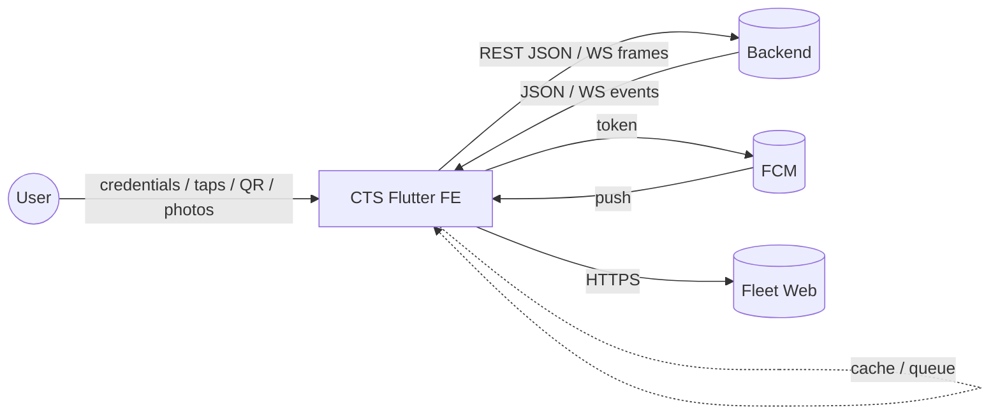

---

### Fig 6 — DFD Level 1 (major FE processes)

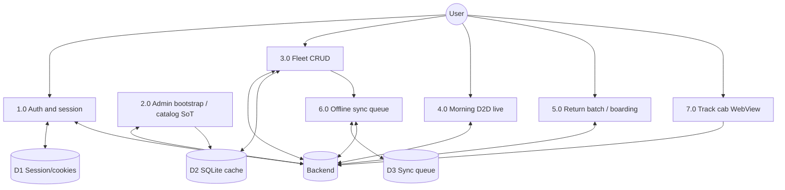

**Inspect (P4/P9):** process **2.0** must feed list UIs from SoT — not N parallel list GETs. **6.0** today = batches primarily (`OfflineFirstBatchRepository`).

---

### Fig 7 — Sequence: cold start

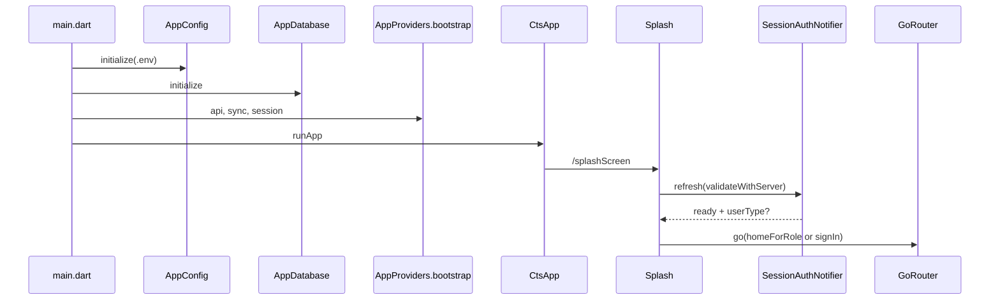

---

### Fig 8 — Sequence: sign-in → role home

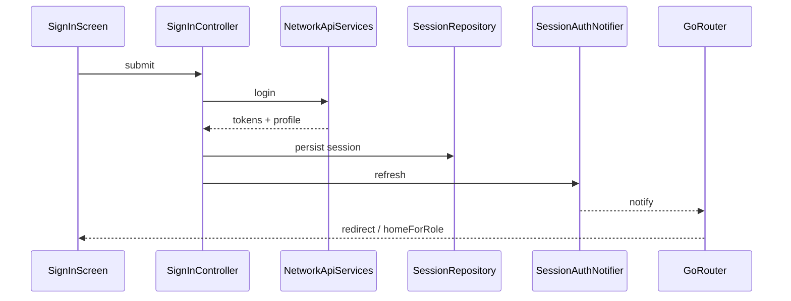

---

### Fig 9 — Sequence: morning D2D (happy path)

```mermaid
sequenceDiagram
  participant UI as D2D Channel UI
  participant P as D2dChannelProvider
  participant REST as D2dRepository
  participant WS as WebSocket
  participant BE as Backend

  UI->>P: start trip
  P->>REST: start + KM/photo
  REST->>BE: HTTPS
  P->>WS: connect (cookie)
  WS<-->>BE: live events
  UI->>P: QR / board / ADD
  P->>WS: actions
  UI->>P: stop
  P->>REST: end + KM
  P->>WS: close
```

---

### Fig 10 — Sequence: 401 / session kill

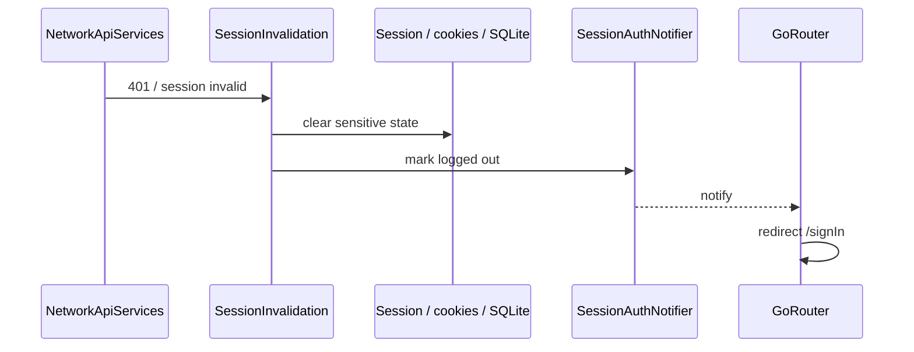

---

### Fig 11 — State: session & trip (simplified)

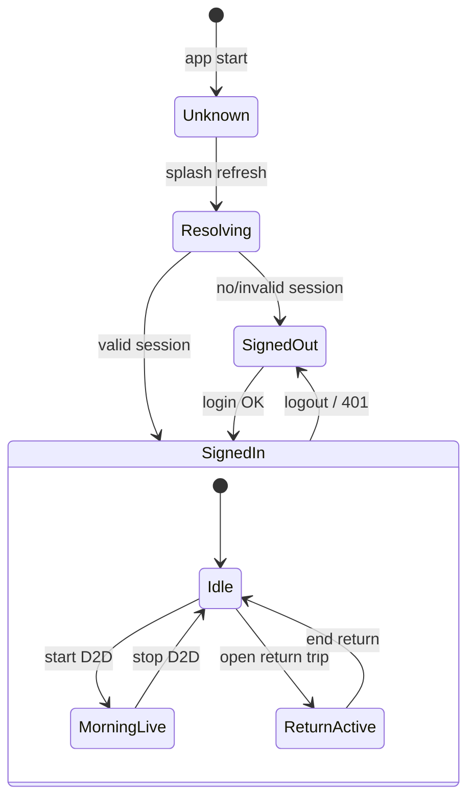

---

### Fig 12 — Target vs legacy (architecture debt)

```mermaid
flowchart LR
  subgraph target [Target]
    F[features/*/screens|providers|models|repositories]
    APP[app/ router DI]
    APIlib[api/]
    CORE[core/sync lifecycle]
    W[widgets/ theme/]
  end
  subgraph legacy [Legacy / provisional]
    AM[appManager/]
    DD[data/ + domain/ shared auth]
  end
  F --> APP
  F --> APIlib
  F --> CORE
  APP --> AM
  F --> DD
```

**Inspect (P3):** arrows into legacy are **debt**. Decide fold / freeze / delete — do not grow `appManager` for new product features. (`offline_temp/` deleted 2026-09-10.)

---

### Fig 13 — Deployment

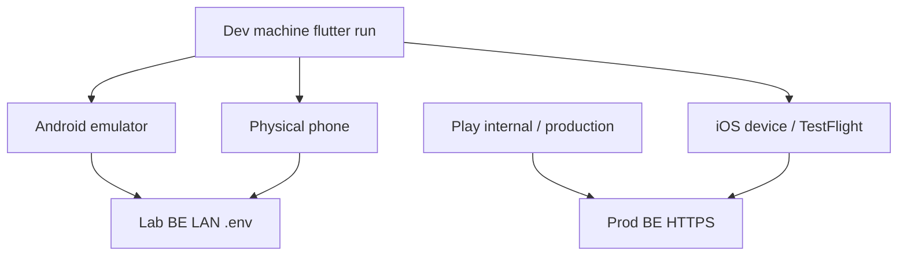

---

## C. How to run (rules)

1. **Walk views V0→V10** using diagrams; then execute matching phases.
2. **Subpoints are dependency-ordered** — run top→bottom inside each phase (do not cherry-pick from the bottom).
3. **One owner per concern** — § E Overlap map. Later phases only **prove** or **measure**.
4. Finding = diagram node/edge **or** checklist ID + severity.
5. After code fixes: re-run **P0**; re-run touched **P8** use cases.
6. **P8** needs BE + accounts (`PROJECT_BRAIN` §5). P0–P7 mostly static/offline (except noted).
7. Each phase has a **Deep-flow gate** — do not advance until that gate passes.

---

## D. Dependency flow (phases)

```text
P0 Baseline ←── V0
 │
 ▼
P1 Structure / containers ←── V1 V2 V3 V8(inventory)
 │
 ├──────────────────────────────┐
 ▼                              ▼
P2 Static UC / sequences        P3 Debt decisions ←── V8
 │   ←── V3 V4 V6 V7            (may start after P1;
 │                                finish before deletes
 │                                that break P2 paths)
 ▼
P4 DFD / API-WS contract ←── V5 V6   ←── requires P2
 │
 ├──────────────────┐
 ▼                  ▼
P5 Security         P6 Code quality     ←── both need P2+P4
 │  (Fig 1b first)
 ▼
P7 Platform / deploy ←── V9 (needs P5.6 permission intent)
 │
 ▼
P8 Device use cases ←── V4 + BE + P7
 │   8A→8B→8C→8D→8E (order locked)
 ▼
P9 Scale / measure ←── V5 V10 (prefer after P8)
 │
 ▼
P10 Release ←── V9 V10
 │
 ▼
P11 Docs freeze
```

| Phase | Requires finished | Unblocks | Owns |
|------:|-------------------|----------|------|
| **0** | — | All | Tooling green; secrets not in git |
| **1** | 0 | 2, 3 | Containers + legacy **inventory** |
| **2** | 1 | 4, 5, 6, 8 | Static UC + sequence **map** |
| **3** | 1 (2 recommended before deletes) | 5–10 clean | Debt **decisions** |
| **4** | **2** | 5, 6, 8, 9 | DFD ↔ API/WS **contract** |
| **5** | 2, 4 | 7, 8, 10 | Trust / STRIDE / wipe / privacy path |
| **6** | 2, 4 | 8, 9 | Component invariants |
| **7** | 0 + **P5.6** | 8, 10 | Manifests / SDK / OEM notes |
| **8** | 2, 4, 7 + **BE** | 9, 10 | Device proof of UCs |
| **9** | 2, 4 (**8 preferred**) | 10 | Measure scale |
| **10** | 0, 7–9 | 11 | Ship |
| **11** | 1–10 | BE packet | Docs + drift |

**Parallel only:** P3 ∥ early P2 (after P1); **P5 ∥ P6** after P2+P4. Never P8 before P4/P7.

---

## E. Overlap map (single owner) — updated after India-ops adds

| Concern | Owner (define) | Later (prove / measure only) |
|---------|----------------|------------------------------|
| Structure / legacy list | **P1** | P3 decides |
| UC / sequence map | **P2** | P8 device |
| Supervisor tile rule | **P2** | P8B |
| Multi-operator **policy** | **P2** | P8C prove · P9 load |
| UC15 / UC16 product status | **P2** | P8D / parked |
| Debt keep/migrate/delete | **P3** | — |
| Bootstrap fields + **TTL contract** | **P4** | P8E refresh · P9 fan-out |
| Sync poison / partial fail **rules** | **P4** | P8B sync · P9.queue |
| Cutoff / `cutoff_applied` / TZ **parse** | **P4** | P8E show |
| WS protocol rules | **P4** | P8 live · P9 storms |
| STRIDE + wipe + privacy path | **P5** | P10 labels align |
| Forms / mounted / dispose | **P6** | P9 memory |
| RTL / Hindi timeline | **P6** | — |
| Manifest / OEM battery note | **P7** | P8C live trip |
| Device journeys | **P8** | — |
| Scale measurements | **P9** | — |
| Analytics / store / release APK | **P10** | — |
| Web N/A + doc freeze | **P11** | — |

---

## Phase 0 — Baseline (V0)

**Requires:** — · **Unblocks:** all  
**Deep-flow gate:** analyze + test + debug build green before any map work.  
**Gate result (2026-09-10 ~19:30 IST):** **PASS** — 0.3 OK (waive infos/warning FIND-003); **0.4 PASS** 168 tests after FIND-001 fix; 0.5 APK OK.

| ID | Checkpoint | Pass? | Notes |
|----|------------|-------|-------|
| FE-0.1 | Flutter/Dart match `pubspec` / `AGENTS.md` | [x] | Flutter 3.47.1 / Dart 3.13.1; sdk ^3.12.2 |
| FE-0.2 | `flutter pub get` clean | [x] | OK (41 outdated constrained) |
| FE-0.3 | `flutter analyze` (errors=0; infos waived listed) | [x] | 0 errors; FIND-003 warning **closed**; remaining infos waived |
| FE-0.4 | `flutter test` green | [x] | **PASS** 168/168 — FIND-001 fixed (`AppDatabase.instanceOrNull`) |
| FE-0.5 | Debug APK / debug build succeeds | [x] | `build/app/outputs/flutter-apk/app-debug.apk` (retry OK ~277s) |
| FE-0.6 | `.env` not in git; `.env.example` complete | [x] | `.env` gitignored; `.env.example` present (untracked) |
| FE-0.7 | Day branch OK (`professor-cts`; not `main`) | [x] | `professor-cts` tracking `origin/professor-cts` |

---

## Phase 1 — Structure / containers (V1–V3, V8 inventory)

**Requires:** P0 · **Unblocks:** P2, P3  
**Deep-flow gate:** Fig 1–3 match disk; legacy **listed** (not decided).  
**Gate result (2026-09-10):** **PASS (inventory)** — continued despite P0.4; no deletes performed.

| ID | Checkpoint | Pass? | Depends |
|----|------------|-------|---------|
| FE-1.1 | External systems match Fig 1 (no FE→DB/Redis) | [x] | FE talks REST/WS + local SQLite only |
| FE-1.2 | Containers match Fig 2; `lib/` vs `LIB_STRUCTURE.md` | [x] | `app/ api/ core/ features/ widgets/ theme/` + legacy roots present |
| FE-1.3 | Features: `screens/providers/models/repositories` only | [x] | No `presentation/` under features; features import root `data/`/`domain/` (legacy shared OK) |
| FE-1.4 | Shared roots: `api/`, `widgets/`, `models/`, `core/`, `theme/` | [x] | Present |
| FE-1.5 | No re-export stubs; one canonical path | [x] | No stub export sweep found |
| FE-1.6 | `app_providers.dart` registers providers used by router/shell | [x] | DI + `AdminBootstrapListSource.bind` at bootstrap |
| FE-1.7 | Inventory legacy imports: `appManager/`, `data/`, `domain/`, `offline_temp/` | [x] | offline_temp **gone**; appManager/`data`/`domain` remain |
| FE-1.8 | Orphan/duplicate candidates listed (no delete) | [x] | **PASS** FIND-008 closed — `http` removed; dio only |
| FE-1.9 | Naming convention noted (`Controller`/`Provider`/`Repository`) | [x] | Mixed `*Controller` + `*Provider` — document only |

---

## Phase 2 — Static flows & use cases (V3, V4, V6, V7)

**Requires:** P1 · **Unblocks:** P4, P5, P6, P8  
**Deep-flow gate:** Every Fig 4 UC has a mapped path; Fig 7–11 match code; multi-op ≠ multi-device written down.  
**Gate result (2026-09-10 ~22:30 IST):** **PASS** — multi-op policy documented (FIND-004 / FE-2.15); UC16 parked confirmed (FIND-005).

### 2A — Shell & routing (before UCs)

| ID | Checkpoint | Pass? | Depends |
|----|------------|-------|---------|
| FE-2.1 | Layer rule: Screen→Provider→Repo→API (exceptions listed) | [x] | Feature HTTP via repos; no Screen→Dio found |
| FE-2.2 | Cold start matches Fig 7 | [x] | `main.dart`: dotenv→AppDatabase→bootstrap→runApp |
| FE-2.3 | Splash → session → `homeForRole` / sign-in | [x] | Splash + `GetInitialRouteUseCase` / `RouteName.homeForRole` |
| FE-2.4 | Fig 4 actors → homes (all six roles) | [x] | `route_names.dart` ADMIN/SUPER_ADMIN/SUPERVISOR/STAFF/DRIVER/COMMUTER |
| FE-2.5 | Router guards match `ROUTING_AND_AUTH` (static) | [x] | `auth_redirect.dart` + AdminCapabilities |
| FE-2.6 | Deep links **resolve** (`?trip=return`, boarding scan) | [x] | `boardingScan`, `returnBoardingScan`, return QR routes in `app_router.dart` |
| FE-2.7 | No `go_router` redirect loops on auth notify | [x] | Splash allowed while resolving; signIn↔home guarded |

### 2B — Use-case map (Fig 4)

| ID | Checkpoint | Pass? | Depends |
|----|------------|-------|---------|
| FE-2.8 | UC4–UC8 admin paths mapped | [x] | admin_home + fleet features + sync badge path |
| FE-2.9 | UC9–UC10 morning path = Fig 9 | [x] | `features/d2d/` channel + QR/odo |
| FE-2.10 | UC11 return path mapped | [x] | `features/batches/` return + boarding |
| FE-2.11 | UC12–UC14 rider paths mapped | [x] | commuter home / track cab / return view |
| FE-2.12 | UC15 intent chips: mapped **or** explicit N/A | [x] | Live in `commuter_home_page.dart` (home/skip/earlier) |
| FE-2.13 | UC16 return-leg KM / unboard: parked (no silent half-UI) | [x] | **PASS** FIND-005 — API only; no half-wired screen (d2d README) |
| FE-2.14 | Supervisor allow-list: new `AdminService` tile updates enum + dashboard + drawer + tests | [x] | `admin_service.dart` + tests present; process rule noted |
| FE-2.15 | Multi-operator same batch: FE expectation documented (≠ multi-device account) | [x] | **PASS** FIND-004 — FLOWS + d2d README |

### 2C — Cross-cutting static paths

| ID | Checkpoint | Pass? | Depends |
|----|------------|-------|---------|
| FE-2.16 | DFD 6.0 sync: queue → badge → Sync now mapped | [x] | `SyncManager` + drawer badge (prod batches path) |
| FE-2.17 | Fig 10: 401 → navigate sign-in (**nav only**; wipe = P5) | [x] | `session_invalidation.dart` → `context.go(signIn)` |
| FE-2.18 | Error / no-internet routes linked | [x] | `/noInternet` + `ErrorPage` errorBuilder |
| FE-2.19 | Fig 11 states reachable (no orphan trip UI) | [x] | D2D + return providers expose live/ended paths |

---

## Phase 3 — Debt vs target architecture (V8)

**Requires:** P1.7–1.8 · **Prefer:** P2 done before large deletes · **Unblocks:** cleaner P5–P10  
**Deep-flow gate:** Every Fig 12 legacy arrow has keep / fold / delete / freeze.  
**Gate result (2026-09-10 ~22:30 IST):** **PASS** — unused deps/assets pruned; theme SoT under `lib/theme/`; freeze rule in LIB_STRUCTURE; FIND-005 parked confirmed.

| ID | Checkpoint | Pass? | Depends |
|----|------------|-------|---------|
| FE-3.1 | Disposition P1 orphans/duplicates | [x] | **http→delete** (0 imports); **dio→keep**; prod SyncManager keep; offline_temp≠prod sync |
| FE-3.2 | `@deprecated` + analyzer deprecated APIs | [x] | One `@Deprecated` `ApiUrl.adminUrl` (unused); no `deprecated_member_use` |
| FE-3.3 | TODO/FIXME/HACK triaged | [x] | 1 lib TODO (`route_names` Dock RCList); UC16 parked = FIND-005 |
| FE-3.4 | **Decide** `offline_temp/` | [x] | **deleted** (2026-09-10) — prod SyncManager/OfflineFirstBatch kept |
| FE-3.5 | **Decide** `appManager/` | [x] | **fold** (keep until migrated) — ~54 feature imports; freeze new surface |
| FE-3.6 | Stubs / fake data off release paths | [x] | **PASS** — offline seed/UI removed with offline_temp |
| FE-3.7 | Debug routes `kDebugMode`-gated | [x] | designWireframes gone; `/offlineTempHome` removed |
| FE-3.8 | Deps: unused + justify `http`+`dio` | [x] | **PASS** FIND-008 — removed `http` + zero-import pkgs; keep `dio` |
| FE-3.9 | Unused assets removed | [x] | **PASS** FIND-009 — pubspec assets = `.env` + `cts_icon.png`; launcher master kept |
| FE-3.10 | Theme SoT vs legacy colors | [x] | **PASS** — `theme/app_colors.dart` SoT; `appManager/colors` thin re-export |
| FE-3.11 | Gate: new features must not add Fig 12 legacy edges | [x] | **PASS** — freeze rule written in LIB_STRUCTURE (FE-3.11) |
---

## Phase 4 — DFD & API/WS contract (V5, V6)

**Requires:** **P2** · **Unblocks:** P5, P6, P8, P9  
**Deep-flow gate:** Fig 6 processes 1.0–6.0 each have a contract row; TTL + poison + cutoff defined before device QA.  
**Gate result (2026-09-10 ~22:30 IST):** **PASS** — TTL explicit none; pagination N/A; Dio timeouts + no Idempotency-Key; dates/odo size contracted; FIND-004/011 closed.

| ID | Checkpoint | Pass? | Depends |
|----|------------|-------|---------|
| FE-4.1 | `lib/api/` ↔ `API_CONTRACTS.md` drift table | [x] | Paths align; cookie→Bearer note scrubbed on odo photo |
| FE-4.2 | `ApiResponseContract` / C1 + tests | [x] | `api_response_contract.dart` + `test/api/api_response_contract_test.dart` |
| FE-4.3 | Process 1.0 auth headers/cookies/refresh | [x] | Bearer + refresh-once in `network_api_services.dart` |
| FE-4.4 | Process 2.0 bootstrap SoT fields FE reads | [x] | `admin_bootstrap_response.dart` ↔ API_CONTRACTS / ADMIN_BOOTSTRAP_DRAFT |
| FE-4.5 | Bootstrap / catalog **TTL + pull-to-refresh contract** | [x] | **PASS** FIND-011 — **no TTL**; PTR + `refreshInBackground` SoT |
| FE-4.6 | Process 3.0 CRUD payloads / pagination | [x] | **PASS** — pagination N/A (full bootstrap lists) documented |
| FE-4.7 | Process 4.0 WS rules (Fig 9) | [x] | Bearer WS + ADD/REMOVE/DELETE/STOP; close 4001/4401/4403 |
| FE-4.8 | Process 5.0 return REST/QR | [x] | return_batch + `?trip=return` mint + shared boarding_scan |
| FE-4.9 | Cutoff / `cutoff_applied` / Asia/Kolkata TZ parse+show rules | [x] | Flag parse+UI; TZ is BE; FE does not recompute |
| FE-4.10 | Process 6.0 sync: partial failure + **poison items** policy | [x] | Continue-on-item-fail; poison @ maxRetries=5 (`OFFLINE_AND_SYNC`) |
| FE-4.11 | Timeouts / retries / idempotent POST policy | [x] | **PASS** — Dio 30s / multipart 60s; refresh-once; no Idempotency-Key |
| FE-4.12 | Date formats + image size limits | [x] | **PASS** — dd-MM-yyyy UI + odo ~200–500KB in API_CONTRACTS |
| FE-4.13 | Env host: release cannot silently use lab | [x] | **PASS** FIND-010 closed — release refuses empty/.lab `172.20.10.2` defaults |
---

## Phase 5 — Security (trust boundary)

**Requires:** P2, P4 · **∥ P6** · **Unblocks:** P7, P8, P10  
**Deep-flow gate:** Fig 1b STRIDE reviewed **first**; wipe + privilege closed before platform manifests.  
**Gate result (2026-09-10 ~22:30 IST):** **PASS** — WebView allow-list + no lab vehicle fallback; privacy contact-admin; splash perms justified; P5.10 residual documented.

| ID | Checkpoint | Pass? | Depends |
|----|------------|-------|---------|
| FE-5.1 | Fig 1b STRIDE reviewed; threats ticketed or accepted | [x] | Spoof/elev accept residual; tamper→4.10; info→5.4/5.7; DoS→P9 |
| FE-5.2 | Token/cookie storage appropriate | [x] | JWT in `FlutterSecureStorage` (`session_manager.dart`) |
| FE-5.3 | TLS prod; cleartext LAN debug-only | [x] | Cleartext manifests debug/profile only; release + FIND-010 refuse lab http |
| FE-5.4 | No secrets in source/logs/share | [x] | `.env` gitignored; Dio logs + API_CALL gated `kDebugMode` (2026-09-10) |
| FE-5.5 | Cert/MITM posture documented | [x] | Pinning N/A; HTTPS/WSS required — `API_AND_ENV.md` |
| FE-5.6 | Each runtime permission **justified** | [x] | **PASS** FIND-012 — splash = notify+camera only; phone/location removed → P7.4/7.5 |
| FE-5.7 | WebView allow-list / JS bridge | [x] | **PASS** FIND-013 — Fleet Edge host allow-list; no JS channels; no lab vehicle fallback |
| FE-5.8 | 401/403 fail closed | [x] | Refresh-once → clear session → signIn; WS 4401/4403 |
| FE-5.9 | QR UI minimizes PII | [x] | Opaque token only in boarding QR panel |
| FE-5.10 | Logout clears cookies + sensitive SQLite + prefs | [x] | Logout `clearAll` + bootstrap cache; **401 residual:** tokens/prefs only (SQLite kept) — §G |
| FE-5.11 | Deep link cannot escalate role | [x] | `auth_redirect` + AdminCapabilities + tests |
| FE-5.12 | In-app privacy / deletion or “contact admin” path | [x] | **PASS** FIND-014 — profile privacy card; real admin mobile or honest copy |

---

## Phase 6 — Code quality (component invariants)

**Requires:** P2, P4 · **∥ P5** · **Unblocks:** P8, P9  
**Deep-flow gate:** Form+async invariants hold on mapped UC paths before device QA.  
**Gate result (2026-09-10 ~22:30 IST):** **PASS** — TextInputAction on CRUD forms; D2D Selector spot; i18n timeline written; 6.10/6.11/6.13 evidenced waives.

| ID | Checkpoint | Pass? | Depends |
|----|------------|-------|---------|
| FE-6.1 | `mounted` after async before nav/snackbar | [x] | Forms + d2d screens guard `if (!mounted)` |
| FE-6.2 | dispose timers/WS/listeners | [x] | D2dChannelProvider + AppLifecycleHost/coordinator |
| FE-6.3 | No release `print`/PII logs | [x] | No `print`; API logs `kDebugMode` only |
| FE-6.4 | Mapped errors to users | [x] | ApiResponseContract + StatusMessage / SnackBarService |
| FE-6.5 | Form validation + product rules | [x] | validators + orgId/date-time product checks |
| FE-6.6 | Double-submit / in-flight guards | [x] | `_isSubmitting` on main CRUD forms |
| FE-6.7 | Keyboard/focus on main forms | [x] | **PASS** FIND-015 — TextInputAction next/done on CRUD forms |
| FE-6.8 | Edit/delete by model id not sort index | [x] | Controllers use model id |
| FE-6.9 | Optimistic UI rollback | [x] | Delete optimistic + insert-on-fail pattern |
| FE-6.10 | Shared snackbar/loading | [x] | **[~]→accepted** — SnackBarService exists; full ScaffoldMessenger migration deferred (P9 polish) |
| FE-6.11 | Unjustified `!` cleaned | [x] | **[~]→accepted** — FIND-003 closed; remaining bang inventory deferred post-v1 |
| FE-6.12 | Narrow rebuilds on hot lists (spot) | [x] | **PASS** FIND-016 — `Selector` + `_D2dChannelSnap` on `d2d_channel` |
| FE-6.13 | A11y primary flows | [x] | **[~]→accepted** — tooltips on Track Cab / D2D FABs; full Semantics sweep deferred |
| FE-6.14 | i18n inventory + **RTL / Hindi (locale) timeline** | [x] | **PASS** FIND-017 — post-v1 timeline in PROJECT_TODOS 7b + FEATURES |
---

## Phase 7 — Platform / deployment config (V9)

**Requires:** P0; **P5.6** · **Unblocks:** P8, P10  
**Deep-flow gate:** Manifests match justified permissions; OEM note written before driver device QA.  
**Gate result (2026-09-10 ~23:05 IST):** **PASS** — phone/location stripped; SDK pins + OEM noted in BUILD_AND_RELEASE; FCM deferred (FIND-018); lifecycle/wakelock/back evidenced.

| ID | Checkpoint | Pass? | Depends |
|----|------------|-------|---------|
| FE-7.1 | Min SDK / min iOS vs fleet | [x] | minSdk 24 · iOS 13.0 — fits India mid-tier + Xiaomi lab |
| FE-7.2 | compileSdk / Gradle / CMake / NDK pinned | [x] | compileSdk **37**; CMake **3.31.6**; NDK via Flutter; Gradle **9.1.0** |
| FE-7.3 | App id, name, icons, splash | [x] | `tech.abhimaarg.cts` · label `cts` · launcher_icons + LaunchTheme |
| FE-7.4 | Android permissions + network security | [x] | **PASS** FIND-012 — dropped phone/location; cleartext debug/profile only |
| FE-7.5 | iOS Info.plist usage strings | [x] | Camera only; `NSLocation*` removed |
| FE-7.6 | FCM init/token hooks in code | [x] | **[~]→accepted** FIND-018 — dep held; no GoogleService*; wire P10 |
| FE-7.7 | Lifecycle resume → session/WS (code) | [x] | `AppLifecycleHost` + coordinator → session + D2D resume |
| FE-7.8 | Back/gesture vs in-flight form/WS (code) | [x] | Forms `canPop: !_isSubmitting`; odo PopScope; D2D dispose→disconnect |
| FE-7.9 | SafeArea / large text shells | [x] | SafeArea on role shells / auth / D2D; Material text scale |
| FE-7.10 | Wakelock only on scanner screens (code) | [x] | `WakelockPlus` only in `boarding_qr_panel.dart` |
| FE-7.11 | OEM battery kill note (Xiaomi/Oppo/Vivo…) for driver live trip | [x] | BUILD_AND_RELEASE + d2d README; prove P8C |

---

## Phase 8 — Device use cases (V4 proof)

**Requires:** P2, P4, P7, **BE up** · **Unblocks:** P9, P10  
**Deep-flow gate:** Run **8A → 8B → 8C → 8D → 8E** in order. 8E needs live journeys first.

### 8A — Auth (UC1–UC3) — first on device

| ID | Checkpoint | Pass? | Depends |
|----|------------|-------|---------|
| FE-8A.1 | Sign-in success / wrong password | [ ] | BE |
| FE-8A.2 | Cold start valid session | [ ] | 8A.1 |
| FE-8A.3 | Cold start expired → sign-in | [ ] | 8A.2 |
| FE-8A.4 | Drawer matches allow-list | [ ] | 8A.2 |

### 8B — Admin-like (UC4–UC8)

| ID | Checkpoint | Pass? | Depends |
|----|------------|-------|---------|
| FE-8B.1 | Dashboard + Add clears forms | [ ] | 8A |
| FE-8B.2 | Fleet CRUD | [ ] | 8B.1 |
| FE-8B.3 | Coming-today / mark-all | [ ] | 8B.2 |
| FE-8B.4 | D2D monitor start/stop/ADD/live | [ ] | 8B.1 |
| FE-8B.5 | Return view/add/End per role | [ ] | 8B.1 |
| FE-8B.6 | Pending sync (+ poison UX if forced) | [ ] | 4.10 |
| FE-8B.7 | Supervisor filtered shell | [ ] | 8A.4 |
| FE-8B.8 | Super Admin vs `/void/` boundary | [ ] | 8B.7 |
| FE-8B.9 | Supervisor still blocked from new full-admin-only tile | [ ] | **8B.7** + 2.14 |

### 8C — Driver (UC9–UC11)

| ID | Checkpoint | Pass? | Depends |
|----|------------|-------|---------|
| FE-8C.1 | Driver home / batch | [ ] | 8A |
| FE-8C.2 | QR + KM photo | [ ] | 8C.1 + P7 camera |
| FE-8C.3 | Return confirm/remove/End | [ ] | 8C.1 |
| FE-8C.4 | Offline messaging | [ ] | 8C.1 |
| FE-8C.5 | Two operators on same live batch: coherent UI | [ ] | **8C.2 or 8B.4** + 2.15 |

### 8D — Rider (UC12–UC15)

| ID | Checkpoint | Pass? | Depends |
|----|------------|-------|---------|
| FE-8D.1 | Commuter home | [ ] | 8A |
| FE-8D.2 | Track Cab WebView | [ ] | 8D.1 + P5.7 |
| FE-8D.3 | Return batch view | [ ] | 8D.1 |
| FE-8D.4 | Offline stays on rider UI | [ ] | 8D.1 |
| FE-8D.5 | Intent chips **or** N/A confirmed | [ ] | 2.12 |

### 8E — Cross-cutting (after 8B/8C)

| ID | Checkpoint | Pass? | Depends |
|----|------------|-------|---------|
| FE-8E.1 | Cutoff / seats messaging when `cutoff_applied` | [ ] | **4.9** + return/morning |
| FE-8E.2 | Pull-to-refresh restores catalog after stale TTL | [ ] | **4.5** + 8B |
| FE-8E.3 | Background→resume during live D2D | [ ] | **8B.4 or 8C.2** |
| FE-8E.4 | Both-device smoke when pushing | [ ] | **Last** (8A–8D) |

---

## Phase 9 — Scale & quality attributes (V5, V10)

**Requires:** P2, P4; **prefer P8** · **Unblocks:** P10  
**Deep-flow gate:** Assumptions written first; measure only after contracts exist; concurrency after happy-path device proof.

### 9A — Assumptions & data path

| ID | Checkpoint | Pass? | Depends |
|----|------------|-------|---------|
| FE-9.1 | Write FE scale assumptions (org/list sizes) | [ ] | **First** |
| FE-9.2 | Process 2.0: no catalog fan-out | [ ] | 4.4–4.5 |
| FE-9.3 | Lists paginated/windowed | [ ] | 9.1 |
| FE-9.4 | Search/filter without shell thrash | [ ] | 9.3 |
| FE-9.5 | Narrow Provider notify on hot paths | [ ] | 6.12 |
| FE-9.6 | SQLite growth: indexes/prune/migrations | [ ] | Fig 6 D2/D3 |
| FE-9.7 | Poison sync items do not block whole queue | [ ] | **4.10** (+ 8B.6 pref) |

### 9B — Realtime & network

| ID | Checkpoint | Pass? | Depends |
|----|------------|-------|---------|
| FE-9.8 | WS: one conn/trip; backoff; no storms | [ ] | 4.7 |
| FE-9.9 | Polling cancelled on dispose | [ ] | 6.2 |
| FE-9.10 | No N+1 from UI loops | [ ] | 9.2 |
| FE-9.11 | Image compress/cache under load | [ ] | 4.12 |
| FE-9.12 | Slow API: skeleton + cancel | [ ] | — |

### 9C — Device measure & concurrency

| ID | Checkpoint | Pass? | Depends |
|----|------------|-------|---------|
| FE-9.13 | Cold-start budget measured | [ ] | Fig 7 |
| FE-9.14 | Long D2D memory stable | [ ] | **prefer P8** |
| FE-9.15 | Wakelock/scanner battery scoped | [ ] | 7.10 |
| FE-9.16 | Release APK/IPA size + asset budget (India mid-tier) | [ ] | — |
| FE-9.17 | Multi-device **same account** rules understood | [ ] | ≠ 9.18 |
| FE-9.18 | Multi-**operator** same batch under load | [ ] | **2.15 + prefer 8C.5** |

---

## Phase 10 — Release (V9, V10)

**Requires:** P0 after fixes; P7–P9 dispositioned · **Unblocks:** P11  
**Deep-flow gate:** Tests/smoke before release binary; privacy labels after P5.12; analytics ≠ crash-only.

| ID | Checkpoint | Pass? | Depends |
|----|------------|-------|---------|
| FE-10.1 | Tests cover auth, contract, d2d, batches, router | [ ] | — |
| FE-10.2 | Gaps from P4/P6/P8 tested or waived | [ ] | 10.1 |
| FE-10.3 | Smoke script current | [ ] | P8 |
| FE-10.4 | Known bugs re-verified | [ ] | — |
| FE-10.5 | **Release**/profile build succeeds | [ ] | 10.1–10.2 |
| FE-10.6 | Obfuscation / split-debug-info | [ ] | 10.5 |
| FE-10.7 | Version bump + release notes owner | [ ] | 10.5 |
| FE-10.8 | Store track plan | [ ] | Fig 13 |
| FE-10.9 | Store listing + privacy nutrition labels | [ ] | — |
| FE-10.10 | Privacy labels ↔ **P5.12** in-app path aligned | [ ] | **5.12 + 10.9** |
| FE-10.11 | Crash reporting decide/wire/ticket | [ ] | — |
| FE-10.12 | Analytics / event taxonomy (or explicit “none yet”) | [ ] | ≠ 10.11 only |
| FE-10.13 | Support logs without PII | [ ] | P5.4 |
| FE-10.14 | Rollback policy | [ ] | 10.8 |

---

## Phase 11 — Docs & diagram freeze

**Requires:** P1–P10 findings · **Unblocks:** BE agent packet  
**Deep-flow gate:** Scope N/A confirmed; then freeze diagrams + backlog.

| ID | Checkpoint | Pass? | Depends |
|----|------------|-------|---------|
| FE-11.1 | Web/desktop remain documented N/A for this prod pass | [ ] | **First** |
| FE-11.2 | Checklist + findings complete | [ ] | P0–P10 |
| FE-11.3 | Diagram ↔ code drift report (Figs 1–13 + 1b) | [ ] | 11.2 |
| FE-11.4 | `PROJECT_BRAIN` §5 accurate | [ ] | — |
| FE-11.5 | `PROMPT_SCOPE` queue updated | [ ] | — |
| FE-11.6 | `DOC_REGISTRY` lists this file | [ ] | — |
| FE-11.7 | `API_CONTRACTS` from P4 drift | [ ] | P4 |
| FE-11.8 | Feature READMEs match | [ ] | — |
| FE-11.9 | BE follow-ups exported | [ ] | — |
| FE-11.10 | `PROJECT_TODOS` remaining items | [ ] | — |
| FE-11.11 | Optional: sync key mermaid into `docs/ARCHITECTURE.md` | [ ] | Ask first |

---

## F. Suggested run plan

| Step | Phases | Deep-flow focus |
|-----:|--------|-----------------|
| 1 | P0 | CLI green |
| 2 | P1 | Containers + legacy list |
| 3 | P2 (2A→2B→2C) | UC map complete |
| 4 | P3 ∥ start P4 | Debt decide · contract |
| 5 | Finish P4 | TTL / poison / cutoff before devices |
| 6 | P5 ∥ P6 | STRIDE first · form invariants |
| 7 | P7 | Manifests + OEM |
| 8 | P8 8A→8E | Device proof in order |
| 9 | P9 9A→9C | Measure |
| 10 | P10 → P11 | Ship · freeze |

**BE agent:** server DFD, authz, indexes, WS fan-out, multi-tenant, million-user **server** capacity.

---

## G. Findings log

| Date | ID or Fig | Severity | Finding | Blocks | Disposition |
|------|-----------|----------|---------|--------|-------------|
| 2026-09-10 | FIND-001 / FE-0.4 | **P1** | CRUD resync threw when DB uninit → false `isSuccess:false` | P0 gate | **Closed** — `AppDatabase.instanceOrNull` + DAO `_db` uses it; 168 tests green |
| 2026-09-10 | FIND-002 / FE-0.5 | P2 | Debug APK first attempt killed/failed; **retry PASS** → `app-debug.apk` | — | Closed (pass) |
| 2026-09-10 | FIND-003 / FE-0.3→6.11 | P3 | Analyze: unused `_connectivityService` in `app_lifecycle_coordinator.dart` | — | **Closed** — field removed |
| 2026-09-10 | FIND-004 / FE-2.15 | P2 | No documented FE multi-operator same-batch policy | P9.18 / P8C.5 | **Closed** — FLOWS + d2d README policy |
| 2026-09-10 | FIND-005 / FE-2.13 | P3 | `boardingUnboard` API constant exists; return-leg KM/unboard UI still parked | UC16 | **Closed** — parked; no half-UI confirmed |
| 2026-09-10 | FIND-006 / FE-1.7→3.4/3.5 | P2 | Heavy `appManager` + `offline_temp` | P3 decisions | **offline_temp deleted**; appManager still **fold** |
| 2026-09-10 | FIND-007 / FE-3.6–3.7 | P2 | Offline Mode + seed data reachable without `kDebugMode` | Release hygiene | **Closed** — `lib/offline_temp/` removed |
| 2026-09-10 | FIND-008 / FE-3.8 | P3 | Unused `http` + several unused pubspec deps | Bundle/debt | **Closed** — removed `http` + zero-import pkgs |
| 2026-09-10 | FIND-009 / FE-3.9 | P3 | Many assets undeclared in Dart (images/img/brand extras) | APK size | **Closed** — pubspec assets pruned to `.env` + `cts_icon.png` |
| 2026-09-10 | FIND-010 / FE-4.13 | **P1** | Release can silently use lab `172.20.10.2` if `.env` missing (`AppConfig`) | Store/prod | **Closed** — release requires env; rejects lab host |
| 2026-09-10 | FIND-011 / FE-4.5 | P2 | Catalog has PTR but no TTL / stale policy | Admin freshness | **Closed** — explicit no TTL; PTR + `refreshInBackground` |
| 2026-09-10 | FIND-012 / FE-5.6 | P3 | Location permission at splash weakly justified (no Geolocator usage found) | P7 | **Closed** — phone+location splash requests removed; P7.4/7.5 note |
| 2026-09-10 | FIND-013 / FE-5.7 | **P1** | Track Cab WebView: unrestricted JS, no navigation allow-list | Store/webview | **Closed** — host allow-list; no lab vehicle fallback |
| 2026-09-10 | FIND-014 / FE-5.12 | P2 | No in-app privacy / account-deletion / contact-admin path | P10.9 | **Closed** — profile privacy card; real admin mobile or honest copy |
| 2026-09-10 | FIND-015 / FE-6.7 | P3 | CRUD forms lack TextInputAction / focus chain | UX | **Closed** — next/done on batch/commuter/cab/driver/route/pop |
| 2026-09-10 | FIND-016 / FE-6.12 | P2 | Hot lists use full `Consumer` (no Selector) | P9 perf | **Closed** — Selector spot on `d2d_channel` |
| 2026-09-10 | FIND-017 / FE-6.14 | P3 | No i18n/RTL/Hindi timeline | Locale | **Closed** — post-v1 timeline in PROJECT_TODOS 7b + FEATURES |
| 2026-09-10 | FE-5.10 residual | P3 | 401 clears tokens/prefs but not SQLite (logout does) | P5 wipe | **Accepted** — documented; full wipe remains logout-only |
| 2026-09-10 | FE-6.10 waive | P3 | Many direct ScaffoldMessenger vs SnackBarService | Polish | **Accepted** — shared service exists; full migrate deferred |
| 2026-09-10 | FE-6.11 waive | P3 | Remaining unjustified `!` inventory | Polish | **Accepted** — FIND-003 closed; bang inventory post-v1 |
| 2026-09-10 | FE-6.13 waive | P3 | Sparse Semantics on primary flows | A11y | **Accepted** — tooltips present; full Semantics sweep deferred |
| 2026-09-10 | FIND-018 / FE-7.6 | P2 | `firebase_messaging` dep; no `Firebase.initializeApp` / token hooks / GoogleService files | P10 push | **Accepted** — deferred; POST_NOTIFICATIONS kept for OS prompt only |

**Severity:** P0 crash/security/trip-fail · P1 major journey wrong · P2 debt/scale · P3 docs/naming

---

## H. Quick path index

| Area | Path |
|------|------|
| Boot | `lib/main.dart`, `lib/app/` |
| HTTP/WS client | `lib/api/`, `features/d2d/` |
| Auth | `features/auth/`, `data/`, `domain/`, `router/` |
| Admin | `admin_home/`, `admin_bootstrap/` |
| Morning | `features/d2d/` |
| Return | `features/batches/` |
| Fleet CRUD | `routes/`, `pops/`, `cabs/`, `drivers/`, `commuters/` |
| Legacy | `appManager/` (offline_temp removed) |
| Docs | `ARCHITECTURE.md`, `ROUTING_AND_AUTH.md`, `API_CONTRACTS.md`, `FLOWS_BY_ROLE.md` |

---

## I. Deep-flow re-check summary (this revision)

| Phase | Flow verdict | What was fixed |
|------:|--------------|----------------|
| P0 | OK | Unchanged order |
| P1 | OK | Legacy inventory **after** structure; orphans before naming |
| P2 | Was broken | Split 2A/2B/2C; UC15/16 + supervisor + multi-op **inside** UC map before sync/401 |
| P3 | OK | Decide legacy before stub/debug gates |
| P4 | Was broken | TTL immediately after bootstrap fields; cutoff after return; poison as process 6.0; env last |
| P5 | Was broken | **STRIDE first**; wipe after fail-closed; privacy path last |
| P6 | Was broken | Double-submit + keyboard **next to** forms; i18n last |
| P7 | OK | OEM after wakelock |
| P8 | Was risky | Locked 8A→8E; 8E cutoff/refresh/resume **after** journeys; smoke last |
| P9 | Was flat | 9A data → 9B realtime → 9C measure/concurrency; poison with SQLite cluster |
| P10 | Was messy | Privacy align beside store labels; analytics beside crash; rollback last |
| P11 | OK | Web N/A first, then freeze |

**ID renumber note:** India-ops rows were **re-sequenced** (IDs changed to match new order). Use this file’s IDs going forward; Fig 1b STRIDE links updated below.

---

**Changelog:** 2026-09-10 13:35 — Deep reflow after India-ops adds. **2026-09-10 18:45** — Inspection started: P0–P2 recorded; FIND-001..006; P0 gate partial fail (tests). **2026-09-10 19:30** — FIND-001 fixed; FE-0.4 PASS (168); P3∥P4 filled; FIND-007..011. **2026-09-10 20:00** — FIND-010+003 closed; P5∥P6 filled; FIND-012..017. **2026-09-10 21:45** — Fat 4-lane continue prompt to close P3–P6 PARTIALS. **2026-09-10 22:30** — L5→L3→L6→L4 closed P3–P6 gates to **PASS**; FIND-004/008/009/011–017 closed; Next → P7. **2026-09-10 23:05** — P7 **PASS**; FIND-012 manifest cleanup; FIND-018 FCM deferred; OEM note; forms `canPop` while submitting; Next → **P8** (needs BE + **go**).

**Next:** Paste CONTINUE prompt → **P8** device use cases (8A→8E) when BE up and user says **go**.
