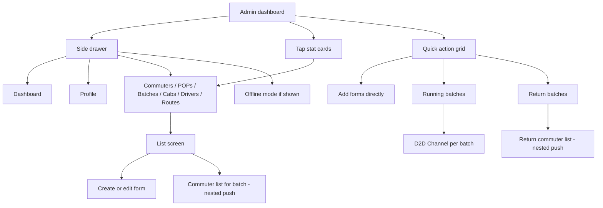
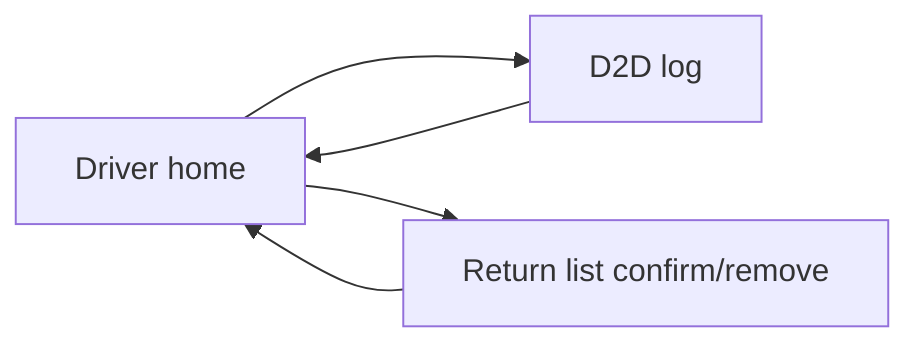

> **Doc:** docs/FLOWS_BY_ROLE.md
> **Updated:** 2026-08-20 22:15 IST
> **Session:** Verified unchanged

# Flows by role

Simple **click-path** guides. For the full route list, see [UI_ARCHITECTURE.md](./UI_ARCHITECTURE.md).

**End-user how-tos:** [guides/ADMIN](./guides/ADMIN_USER_GUIDE.md) · [guides/DRIVER](./guides/DRIVER_USER_GUIDE.md) · [guides/COMMUTER](./guides/COMMUTER_USER_GUIDE.md)

---

## Admin

**Home:** `/adminHomeScreen` — Dashboard with stats and quick actions. Accounts are created here (CRUD); there is no public Sign Up.

| Goal | How |
|------|-----|
| Add a route / batch / commuter / driver / cab / POP | Dashboard **Add …** (opens a **blank** create form) *or* Drawer → list → **+** |
| Edit the person you swiped | Batches → batch row → commuter list → swipe **EDIT** (A–Z sort still edits that row) |
| Mark coming today for a commuter | Batches → tap batch → Coming switch *or* Drawer → Commuters → Coming switch |
| Add a commuter with email | Email is required. Address is optional; if left empty, the email is stored as address |
| See live trips | Quick action **Running Batches** → tap batch → **D2D Channel** |
| Add a rider to the live D2D list | D2D Channel or driver log → **+** sheet (all commuters). They appear on the list only after the server accepts ADD (needs a POP). |
| See who is already in the cab | **Already IN** section above Live queue on D2D Channel and driver log (from WS `already_in`) |
| End a morning trip | Only the **driver** **STOP TRIP** button. Admin **Close channel** / back does not end the day. |
| Manage return trip | Dashboard **Return Batches** *or* Batches toolbar return icon → pick batch → Available (**Home** then **Overflow**) shows current `Coming today` commuters for this org; admin can add from Available and monitor Confirmed |
| Work offline | Drawer → **Offline Mode** (when enabled) |
| Log out | Drawer → Profile → **Logout** |

---

## Driver

**Home:** `/driverHomeScreen` — Today’s assignment (batch, time, cab).

| Step | Action |
|------|--------|
| 1 | Open app → sign in as driver |
| 2 | Review assignment card; optional **call admin** |
| 3 | Tap **START TRIP** → `/d2dLog/:batchId` |
| 4 | Use commuter list — swipe green confirm pickup, red remove; **+** to add rider |
| 5 | **STOP TRIP** (red FAB) → ends the day for this batch. Back / leaving the screen only disconnects; the trip stays active |
| 6 | Optional: **RETURN LIST** → `/driverReturnCommuter/:batchId` (Confirm / Remove / **End return**). Admin can add commuters and monitor confirmed riders |

---

## Commuter

**Home:** `/commuterHomeScreen` — Greeting + **Coming today** switch.

| Step | Action |
|------|--------|
| 1 | Open app → sign in as commuter |
| 2 | Toggle **Coming** switch |
| 3 | Confirm in dialog |
| 4 | Pull to refresh to reload profile |
| 5 | Tap **Track your Cab** — opens Fleet Edge map for your assigned cab (`trackingVehicleId` from admin cab record; lab default if unset) |

---

## Everyone (auth)

| Step | Screen |
|------|--------|
| App launch | Splash → resolves session |
| Not logged in | Sign in (accounts are created by an admin, not public sign-up) |
| Debug only | Sign in → **Preview UI wireframes** |

---

## Wireframe previews (same flows, no data)

Open [WIREFRAME_GALLERY.md](./WIREFRAME_GALLERY.md) and pick the screen that matches your role above.
