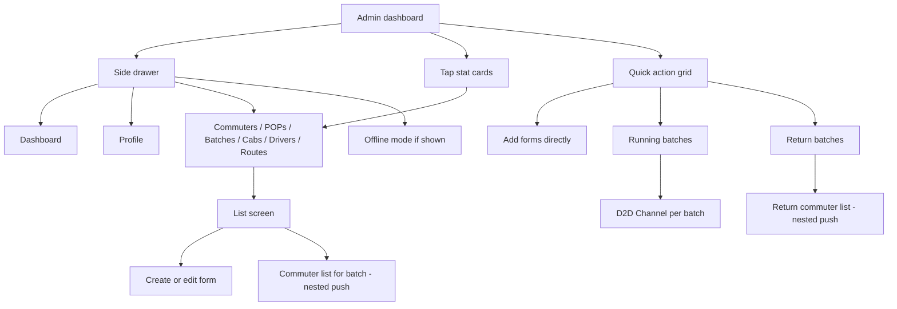
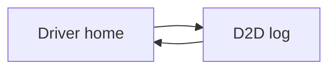

# Flows by role

Simple **click-path** guides. For the full route list, see [UI_ARCHITECTURE.md](./UI_ARCHITECTURE.md).

---

## Admin

**Home:** `/adminHomeScreen` — Dashboard with stats and quick actions.

| Goal | How |
|------|-----|
| Add a route | Dashboard → **Add Route** *or* Drawer → Routes → **+** |
| See live trips | Quick action **Running Batches** → tap batch → **D2D Channel** |
| Manage return trip | Batches screen → return icon *or* quick action **Return Batches** |
| Work offline | Drawer → **Offline Mode** (when enabled) |
| Log out | Drawer → Profile → **Logout** |

---

## Driver

**Home:** `/driverHomeScreen` — Today’s assignment (batch, time, cab).

| Step | Action |
|------|--------|
| 1 | Open app → sign in as driver |
| 2 | Review assignment card; optional **call admin** |
| 3 | Tap **START TRIP** → `/d2dLog/:batchId` |
| 4 | Use commuter list (call / status actions) |
| 5 | Stop trip → back to driver home |

---

## Commuter

**Home:** `/commuterHomeScreen` — Greeting + **Coming today** switch.

| Step | Action |
|------|--------|
| 1 | Open app → sign in as commuter |
| 2 | Toggle **Coming** switch |
| 3 | Confirm in dialog |
| 4 | Pull to refresh to reload profile |

---

## Everyone (auth)

| Step | Screen |
|------|--------|
| App launch | Splash → resolves session |
| Not logged in | Sign in → optional Sign up |
| Debug only | Sign in → **Preview UI wireframes** |

---

## Wireframe previews (same flows, no data)

Open [WIREFRAME_GALLERY.md](./WIREFRAME_GALLERY.md) and pick the screen that matches your role above.
