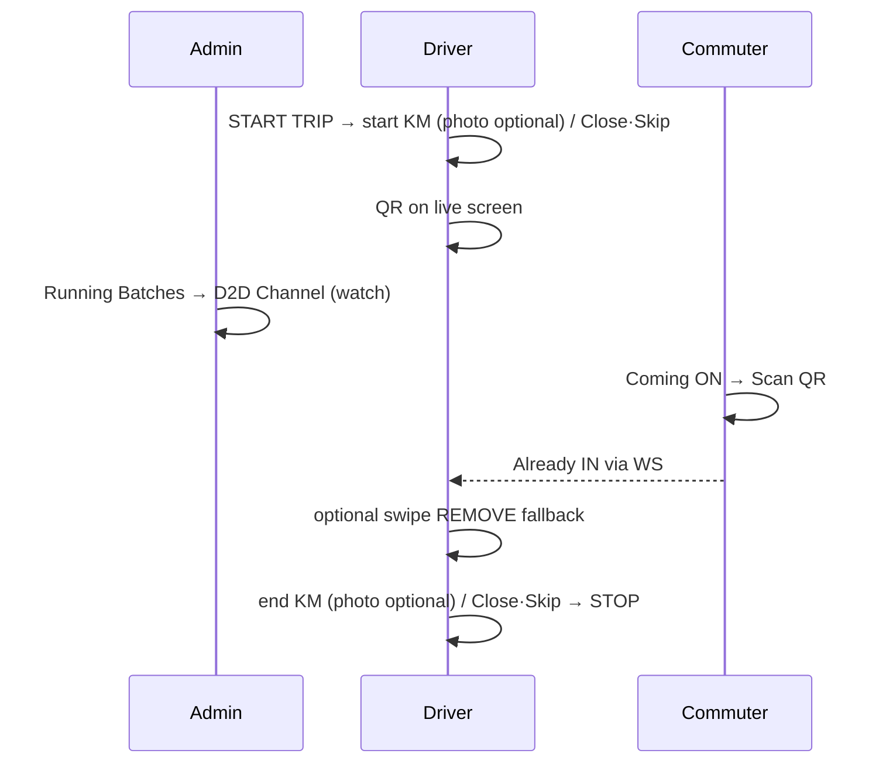
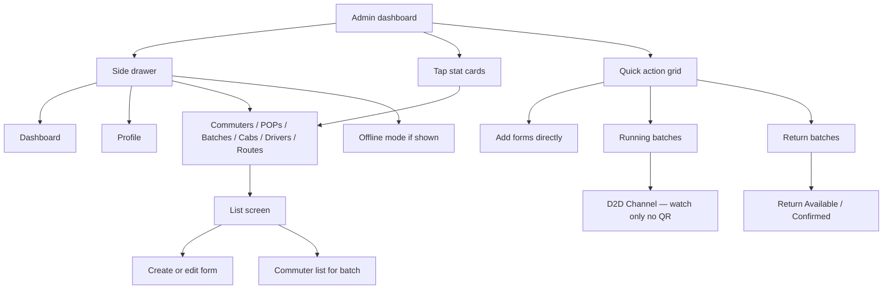
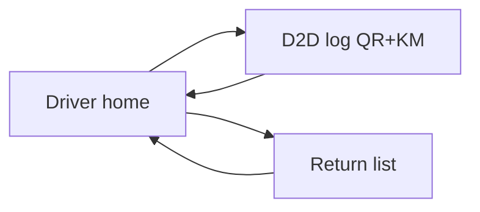

> **Doc:** docs/FLOWS_BY_ROLE.md
> **Updated:** 2026-08-26 07:53 IST
> **Session:** Odometer Close/Skip + photo optional

# Flows by role

Canonical **click-paths** for humans, QA, and agents. Routes: [UI_ARCHITECTURE.md](./UI_ARCHITECTURE.md). Wire: [API_CONTRACTS.md](./API_CONTRACTS.md). Product locks: [client_req/05-open-decisions.md](./client_req/05-open-decisions.md). Lab accounts / LAN: [LOCAL_DEV.md](./LOCAL_DEV.md) · [PROJECT_BRAIN §5](../PROJECT_BRAIN.md).

**Doc split:** journeys live **here** (not `guides/`). Smoke script: [client_req/07](./client_req/07-NEXT-AGENT-PROMPT.md). Handoff pointer: [DISCUSSION_LOG](./client_req/DISCUSSION_LOG.md).

---

## Morning QR + KM (happy path — all roles)

Use this for STEP 8 / device smoke. Batch-01 lab: admin `7069036462`, driver `9876544111`, any Mark-Coming commuter on that batch.

| # | Who | Clicks | Expect |
|---|-----|--------|--------|
| 1 | Driver | Home → **START TRIP** | `/d2dLog/:batchId` connects WS |
| 2 | Driver | Start-KM sheet: type **KM** → Confirm (± optional camera). **Close** / **Skip** leave without record | No swipe-dismiss; KM required only on Confirm; photo optional |
| 3 | Driver | See boarding **QR** + Live queue | Wakelock on; admin has **no** QR |
| 4 | Admin | Dashboard → **Running Batches** → batch → **D2D Channel** | Same live list; watch Already IN |
| 5 | Commuter | **Coming** ON → **Scan** → `/boardingScan` | Scan cab QR → Boarded |
| 6 | Driver | Rider appears under **Already IN** | Same as swipe REMOVE / WS |
| 7 | Driver | Optional: swipe green on one rider | Fallback if phone/scan fails |
| 8 | Driver | Before STOP: end-KM sheet (Close/Skip OK; skip sheet if endKm set) | Soft STOP if dismissed |
| 9 | Driver | **STOP TRIP** | Trip ended; reconnect same day → 4001 |

**Locks (do not reopen):** commuter scans (not driver); scan = boarded; soft STOP; KM required photo optional; Close/Skip on sheet (no swipe-dismiss); camera-only when photo taken; return-trip QR / return KM UI parked.

**Fail checks worth one try:** scan without Coming → error; expired QR → driver refresh; leave screen without STOP → trip still active.

---

## Admin

**Home:** `/adminHomeScreen` — Dashboard. Accounts are created here (CRUD); no public Sign Up.

| Goal | How |
|------|-----|
| Add route / batch / commuter / driver / cab / POP | Dashboard **Add …** (blank create) *or* Drawer → list → **+** |
| Edit swiped row | Batches → batch → commuter list → swipe **EDIT** |
| Mark coming (one) | Batch Coming switch *or* Commuters list Coming switch |
| Mark all coming (org) | Commuters screen action (org-wide) |
| Add commuter email | Email required; empty address → store email as address |
| Watch morning live | **Running Batches** → **D2D Channel** — list + Already IN; **no QR**; **Close channel** ≠ STOP |
| Add rider to live list | Channel **+** sheet (needs POP); toast only after ADD lands |
| Morning QR / KM | Driver owns QR + odometer; admin only observes |
| Return trip | **Return Batches** → Available (Home then Overflow) / Confirmed; admin Confirm / Remove |
| Offline | Drawer → **Offline Mode** (when enabled) |
| Log out | Drawer → Profile → **Logout** |

---

## Driver

**Home:** `/driverHomeScreen` — Today’s assignment (batch, time, cab).

### Morning live (QR + KM)

| Step | Action | Route / UI |
|------|--------|------------|
| 1 | Sign in as driver | `/driverHomeScreen` |
| 2 | **START TRIP** | `/d2dLog/:batchId` |
| 3 | Record **start KM** (± optional photo); Close / Skip to leave | Modal sheet — no swipe-dismiss |
| 4 | Drive with **QR** visible + Live queue | `boarding_qr_panel` + list |
| 5 | Swipe green = pickup (fallback); red = remove from live only; **+** add | WS REMOVE / DELETE / ADD |
| 6 | Before end: **end KM** (± photo); Close / Skip OK | Modal sheet |
| 7 | **STOP TRIP** (red FAB) | Ends morning for this batch |

Back / leave screen = **disconnect only** — trip stays `isActive` until STOP.

### Evening return

| Step | Action |
|------|--------|
| 1 | Home → **RETURN LIST** → `/driverReturnCommuter/:batchId` |
| 2 | Confirm / Remove riders |
| 3 | **End return** (driver FAB; admin monitors) |

---

## Commuter

**Home:** `/commuterHomeScreen` — Coming today + Return today + Scan + Track Cab.

### Morning board (QR)

| Step | Action | Notes |
|------|--------|-------|
| 1 | Sign in | `/commuterHomeScreen` |
| 2 | Toggle **Coming** ON + confirm | Required before scan (D2) |
| 3 | Tap **Scan** | `/boardingScan` |
| 4 | Point camera at **driver cab QR** | Success → Boarded / Already IN on driver |
| 5 | Errors | `not_coming`, `wrong_batch`, `expired_token`, `trip_not_active`, … → SnackBar |

### Other home actions

| Step | Action |
|------|--------|
| Return today | Home / Skip / Earlier… (intent chips — not seat confirm) |
| Pull to refresh | Reload profile + intent |
| Track your Cab | Fleet Edge WebView (`trackingVehicleId`) |

---

## Everyone (auth)

| Step | Screen |
|------|--------|
| App launch | Splash → session |
| Not logged in | Sign in (admin-created accounts only) |
| `/signUp` deep link | Redirects to sign in |

---

## QA / agent smoke (short)

Mirror of [07 STEP 8](./client_req/07-NEXT-AGENT-PROMPT.md) — run only when user says **go**.

1. Emulator **admin** — Running Batches → Channel (watch).
2. Phone **driver** — START → start KM (± photo) or Close/Skip → QR up.
3. Commuter — Coming ON → Scan → Already IN on driver (+ admin channel).
4. Driver — one swipe REMOVE fallback.
5. Driver — end KM (± photo) or Close/Skip → STOP.
6. Log pass/fail in DISCUSSION_LOG + PROJECT_BRAIN §5.

Accounts / devices: [TESTING.md](./TESTING.md) · PROJECT_BRAIN §5.

---

## Layout notes

Screen structure and controls: [UI_ARCHITECTURE.md](./UI_ARCHITECTURE.md).  
Feature behavior: [lib/features/d2d/README.md](../lib/features/d2d/README.md) · [lib/features/batches/README.md](../lib/features/batches/README.md).
