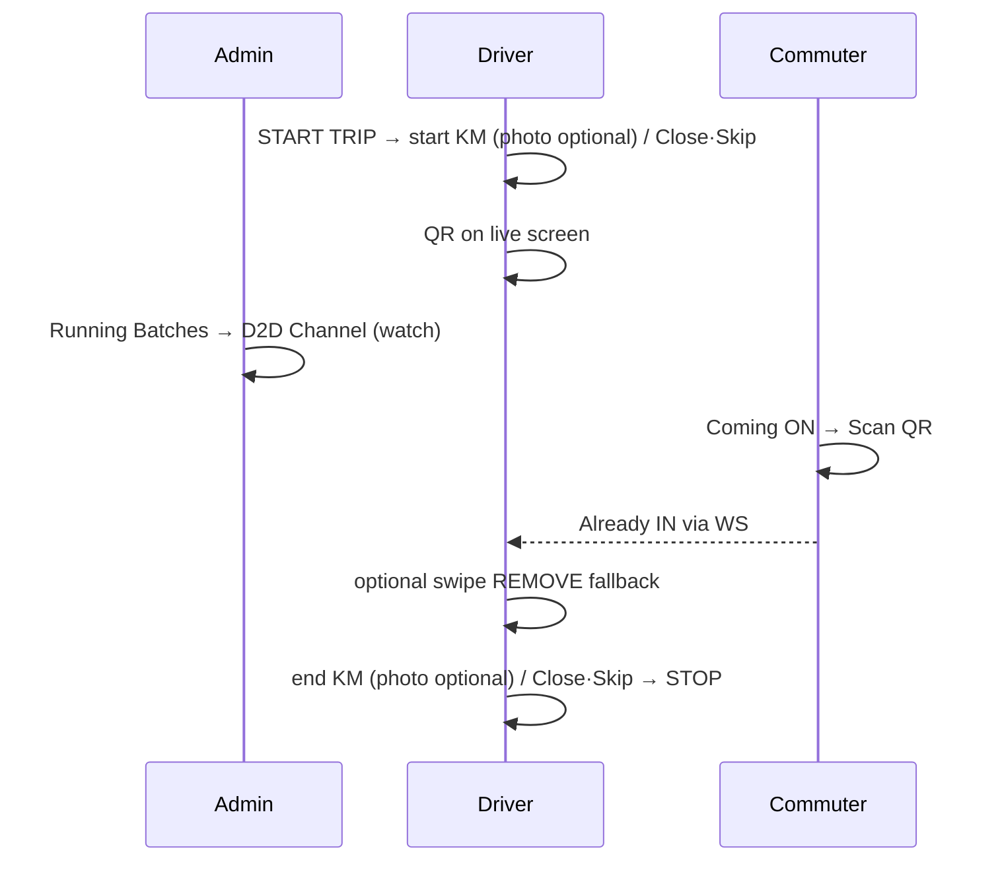
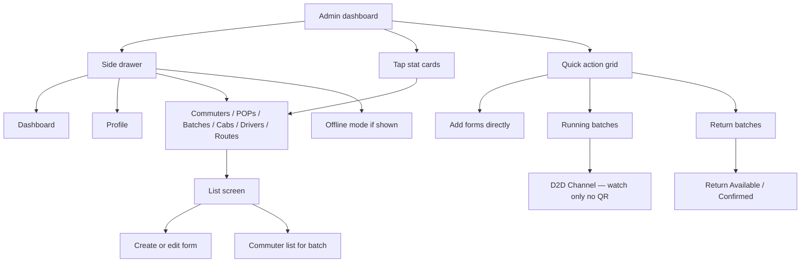
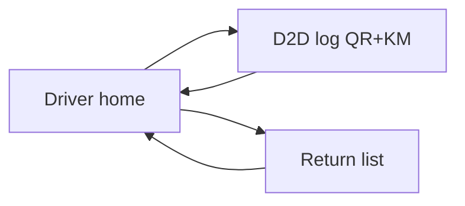

> **Doc:** docs/FLOWS_BY_ROLE.md
> **Updated:** 2026-09-15 22:35 IST
> **Session:** D2D cream Admin/Driver; no driver Add; other-batch red/beeps

# Flows by role

Canonical **click-paths** for humans, QA, and agents. Routes: [UI_ARCHITECTURE.md](./UI_ARCHITECTURE.md). Wire: [API_CONTRACTS.md](./API_CONTRACTS.md) (owns schema/API inventory). Lab accounts / LAN: [LOCAL_DEV.md](./LOCAL_DEV.md) · [PROJECT_BRAIN §5](../PROJECT_BRAIN.md). Handoff: [setup/DISCUSSION_STATUS.md](./setup/DISCUSSION_STATUS.md).

**Doc split:** journeys + product locks live **here**. STEP 8 checklist: [STEP8_DEVICE_SMOKE_CHECKLIST.txt](./STEP8_DEVICE_SMOKE_CHECKLIST.txt). Do not recreate `client_req/` or `guides/`.

---

## Product story + locks (ex–client_req/05)

**Problem:** Driver cannot swipe-confirm ~50+ pickups while driving; also need daily cab run KM with proof.

**Morning (shipped UI):** START → odometer (KM required, photo optional; Close/Skip OK) → cab QR on live screen → commuter Coming ON + scan → boarded (swipe = fallback) → end KM → STOP. Admin/Supervisor cream **D2D Channel** (no QR; may **Add**); Driver live log **no Add**. Other-batch riders: **red tint** + short/long board beep (driver + boarding commuter). Wire: [API_CONTRACTS](./API_CONTRACTS.md) WS `batchId`; UI: [d2d README](../lib/features/d2d/README.md).

| # | Decision | Default |
|---|----------|---------|
| D1 | Hard-block WS STOP until morning odometer end? | **No** — soft `complete` flag |
| D2 | Must `isComing` / live queue before scan? | **Yes** |
| D3 | Scan only home batch? | **Yes** (v1) |
| D4 | `BoardingEvent` table in v1? | **No — SKIP** — CList only |
| D5 | Un-board API in v1? | **Yes** BE; Flutter UI parked |
| D6 | Media public nginx vs auth download? | **Auth download** for photos |
| D7 | Return odometer in same migration/APIs? | **Yes**; Flutter return UI later |
| D8 | Scan = boarded (not queue-only)? | **Yes** |
| D9 | Who scans? | **Commuter scans cab QR** |
| D10 | OCR for KM? | **No** (v1) |

**Parked:** return-leg KM UI; admin org odometer list; unboard UI.

---

## Morning QR + KM (happy path — all roles)

Use this for STEP 8 / device smoke. Batch-01 lab: admin `7069036462`, driver `9876544111`, any Mark-Coming commuter on that batch.

| # | Who | Clicks | Expect |
|---|-----|--------|--------|
| 1 | Driver | Home → **START TRIP** | `/d2dLog/:batchId` connects WS |
| 2 | Driver | Start-KM sheet: type **KM** → Confirm (± optional camera). **Close** / **Skip** leave without record | No swipe-dismiss; KM required only on Confirm; photo optional |
| 3 | Driver | See boarding **QR** + Live queue | Wakelock on; admin has **no** QR |
| 4 | Admin | Dashboard → **Running Batches** → batch → **D2D Channel** | Same live list; watch Already IN |
| 5 | Commuter | **Coming** ON → **Scan** → `/boardingScan` | Scan cab QR → Boarded |
| 6 | Driver | Rider appears under **Already IN** | Same as swipe REMOVE / WS |
| 7 | Driver | Optional: swipe green on one rider | Fallback if phone/scan fails |
| 8 | Driver | Before STOP: end-KM sheet (Close/Skip OK; skip sheet if endKm set) | Soft STOP if dismissed |
| 9 | Driver | **STOP TRIP** | Trip ended; reconnect same day → 4001 |

**Locks (do not reopen):** commuter scans (not driver); scan = boarded; soft STOP; KM required photo optional; Close/Skip on sheet (no swipe-dismiss); return QR Phase 2 wired (`?trip=return` + boarding_scan) — [docs/setup/RETURN_QR_UI_PREP.md](./setup/RETURN_QR_UI_PREP.md) · [RETURN_TRIP_API_GAP.md](./setup/RETURN_TRIP_API_GAP.md); return KM UI parked.

### Multi-operator same batch (FE policy — FIND-004 / FE-2.15)

**≠ multi-device same account.** Multiple **distinct operator sessions** (admin / supervisor / driver) may open the **same batch** live channel or return list concurrently.

| Surface | FE expectation |
|---------|----------------|
| Morning D2D WS | Last successful action wins; all connected clients receive the same Redis broadcast. FE does **not** lock the batch to one operator device. |
| Evening return REST | Confirm / remove / end are idempotent enough for concurrent monitors; UI refreshes from latest GET / push-equivalent pull. |
| Conflict UX | No FE “batch locked by X” modal. Stale local lists refresh on resume / PTR. |

**Fail checks worth one try:** scan without Coming → error; expired QR → driver refresh; leave screen without STOP → trip still active.

---

## Admin

**Home:** `/adminHomeScreen` — Dashboard. Accounts are created here (CRUD); no public Sign Up.

**Roles on this shell:** `ADMIN` / `SUPER_ADMIN` (all tiles) and `SUPERVISOR` (allow-listed services only — see [ROUTING_AND_AUTH.md](./ROUTING_AND_AUTH.md) `AdminService`). `STAFF` uses **commuter** home, not this shell. Web org ops for SUPER_ADMIN: Django `/void/` (no Flutter web admin yet).

| Goal | How |
|------|-----|
| Add route / batch / commuter / driver / cab / POP | Dashboard **Add …** (blank create) *or* Drawer → list → **+** |
| Edit swiped row | Batches → batch → commuter list → swipe **EDIT** |
| Mark coming (one) | Batch Coming switch *or* Commuters list Coming switch |
| Mark all coming (org) | Commuters screen action (org-wide) |
| Add commuter email | Email required; empty address → store email as address |
| Watch morning live | **Running Batches** → **D2D Channel** — cream live log; may **Add** (Admin/Supervisor); Board/Remove; **no QR**; **Close channel** ≠ STOP; other-batch **red** |
| Add rider to live list | Channel **+** sheet (needs POP); toast only after ADD lands |
| Morning QR / KM | Driver owns QR + odometer; admin only observes |
| Return trip | **Return Batches** → Available (Home then Overflow) / Confirmed; admin Confirm / Remove |
| Offline | Drawer → **Offline Mode** (when enabled) |
| Log out | Drawer → Profile → **Logout** |

---

## Driver

**Home:** `/driverHomeScreen` — Today’s assignment (batch, time, cab).

### Morning live (QR + KM)

| Step | Action | Route / UI |
|------|--------|------------|
| 1 | Sign in as driver | `/driverHomeScreen` |
| 2 | **START TRIP** | `/d2dLog/:batchId` |
| 3 | Record **start KM** (± optional photo); Close / Skip to leave | Modal sheet — no swipe-dismiss |
| 4 | Drive with **QR** visible + Live queue | `boarding_qr_panel` + cream list; **no Add Commuter**; other-batch red + board beeps |
| 5 | Swipe green = pickup (fallback); red = remove from live only; **+** add | WS REMOVE / DELETE / ADD |
| 6 | Before end: **end KM** (± photo); Close / Skip OK | Modal sheet |
| 7 | **STOP TRIP** (red FAB) | Ends morning for this batch |

Back / leave screen = **disconnect only** — trip stays `isActive` until STOP.

### Evening return

| Step | Action |
|------|--------|
| 1 | Home → **RETURN LIST** → `/driverReturnCommuter/:batchId` |
| 2 | Confirm / Remove riders; **Waiting line** visible when pool non-empty |
| 3 | **BOARDING QR** → `/returnBoardingQr/:batchId` (UI prep — stub; visual parity; binds later to return trip log / RCList) |
| 4 | **End return** (driver FAB; admin monitors) — clears confirmed + waiting |

**Return QR (Phase 2):** same UX as morning; mint `GET …/boarding_qr/<batch>/?trip=return`; scan `POST …/boarding_scan/` (token leg=return; **no** `join_waiting` on this path). Live **RCList** = user-ID list on return trip log row. FE Dart: `returnTripLogId` ← `return_trip_id`, `tripLeg` ← `trip`. On End, BE archives — **FE no archive UI**. [setup/RETURN_QR_UI_PREP.md](./setup/RETURN_QR_UI_PREP.md) · [RETURN_TRIP_API_GAP.md](./setup/RETURN_TRIP_API_GAP.md).

---

## Commuter

**Home:** `/commuterHomeScreen` — Coming today + Return today + Scan + Track Cab.

### Morning board (QR)

| Step | Action | Notes |
|------|--------|-------|
| 1 | Sign in | `/commuterHomeScreen` |
| 2 | Toggle **Coming** ON + confirm | Required before scan (D2) |
| 3 | Tap **Scan** | `/boardingScan` |
| 4 | Point camera at **driver cab QR** | Success → Boarded / Already IN on driver |
| 5 | Errors | `not_coming`, `wrong_batch`, `expired_token`, `trip_not_active`, … → SnackBar |

### Other home actions

| Step | Action |
|------|--------|
| Return today | Home / Skip / Earlier… (intent chips — not seat confirm) |
| Join return waiting | Link under Return today → `POST add_commuter` `action: join_waiting` (FCFS) |
| Scan return boarding QR | Link → `/returnBoardingScan` → shared `POST boarding_scan` (token leg=return) |
| Pull to refresh | Reload profile + intent |
| Track your Cab | Fleet Edge WebView (`trackingVehicleId`) |

---

## Everyone (auth)

| Step | Screen |
|------|--------|
| App launch | Splash → session |
| Not logged in | Sign in (admin-created accounts only) |
| `/signUp` deep link | Redirects to sign in |

---

## QA / agent smoke (short)

Run only when user says **go**. Full checklist: [STEP8_DEVICE_SMOKE_CHECKLIST.txt](./STEP8_DEVICE_SMOKE_CHECKLIST.txt).

1. Emulator **admin** — Running Batches → Channel (watch).
2. Phone **driver** — START → start KM (± photo) or Close/Skip → QR up.
3. Commuter — Coming ON → Scan → Already IN on driver (+ admin channel).
4. Driver — one swipe REMOVE fallback.
5. Driver — end KM (± photo) or Close/Skip → STOP.
6. Log pass/fail in [DISCUSSION_STATUS](./setup/DISCUSSION_STATUS.md) + PROJECT_BRAIN §5.

Accounts / devices: [TESTING.md](./TESTING.md) · PROJECT_BRAIN §5.

---

## Layout notes

Screen structure and controls: [UI_ARCHITECTURE.md](./UI_ARCHITECTURE.md).  
Feature behavior: [lib/features/d2d/README.md](../lib/features/d2d/README.md) · [lib/features/batches/README.md](../lib/features/batches/README.md).
