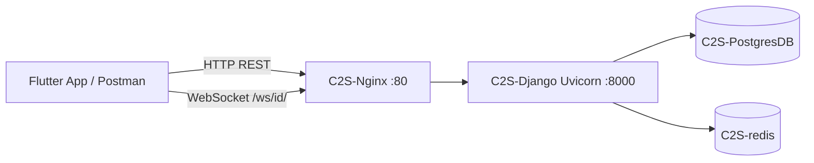
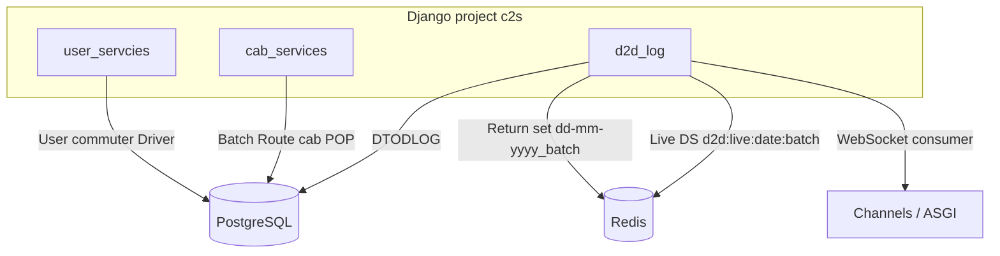
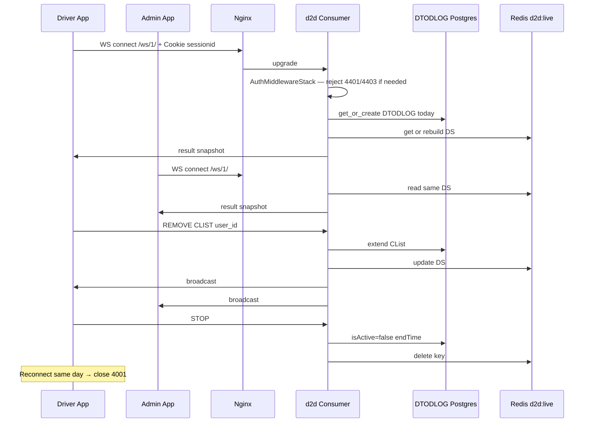
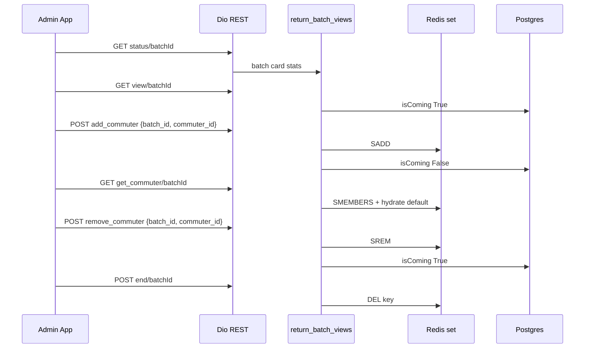
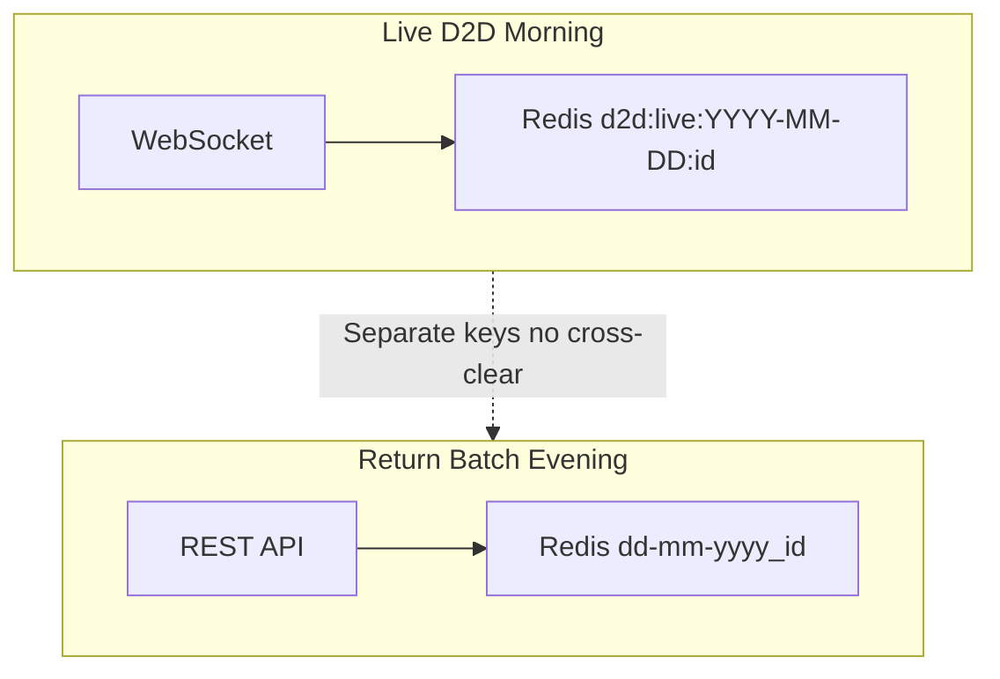
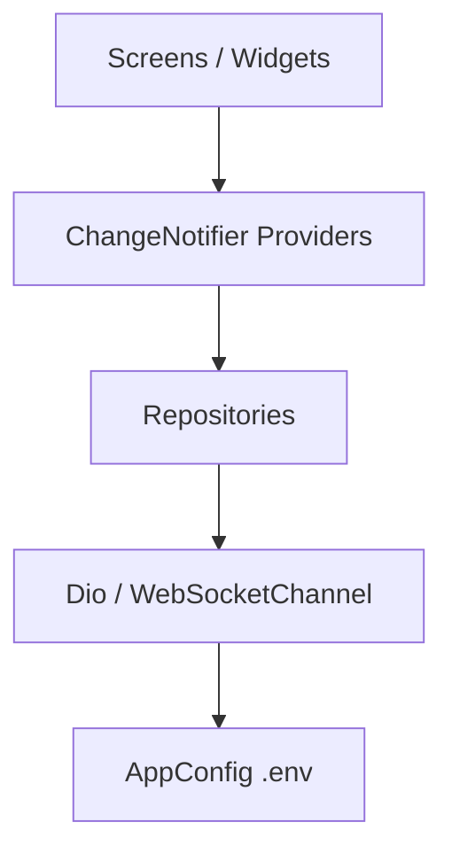
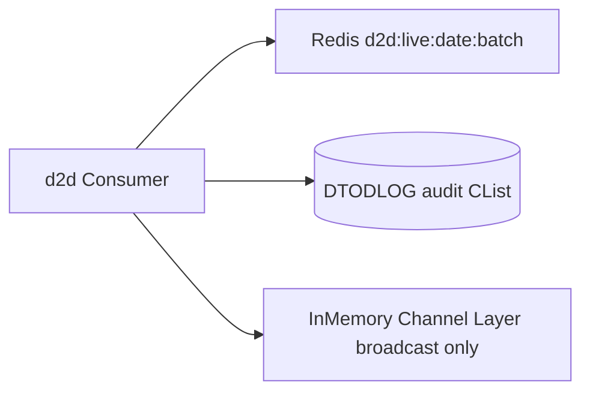
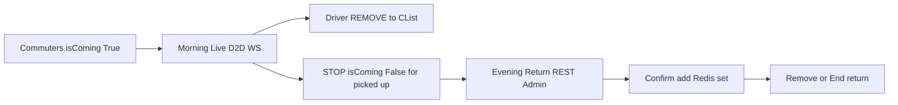

> **Doc:** docs/INTEGRATION.md
> **Updated:** 2026-08-14 21:55 IST
> **Session:** DTODLOG on connect; driver STOP; ADD by user ID

# Integration — Full-Stack Overview

College/office shuttle management platform spanning `D:\cts_beta` (Flutter) and `D:\cts-docker` (Django).

## Purpose

- **Admin** — routes, batches (time slots), pickup points (POPs), cabs, drivers, commuters
- **Driver** — live door-to-door (D2D) pickup log via WebSocket during morning runs
- **Commuter** — assigned to batch/cab/POP; toggles `isComing` for daily attendance

## Two codebases

| Repo | Path | Role |
|------|------|------|
| **Flutter app** | `D:\cts_beta` | iOS/Android mobile client |
| **Backend pack** | `D:\cts-docker` | Dockerized Django API + WebSocket server |

Separate git repos. Backend runs via Docker Desktop; Flutter connects over LAN HTTP/WebSocket.

## Technology summary

| Layer | Technology |
|-------|------------|
| Mobile | Flutter, Provider (`ChangeNotifier`), go_router |
| API | Django 4.2.5 + Django REST Framework 3.14 |
| Real-time | Django Channels 4 + Uvicorn ASGI |
| Database | PostgreSQL 16 |
| Cache | Redis — morning `d2d:live:…`, evening `{date}_{batch}`; Channels uses InMemoryLayer for WS broadcast |
| Reverse proxy | Nginx on host port 80 |

## Django apps (`D:\cts-docker\django`)

| App | Responsibility |
|-----|----------------|
| `user_servcies` | Custom User (mobile login), commuter, driver, subAdmin |
| `cab_services` | Routes, batches, pickup points, cabs |
| `d2d_log` | DTODLOG model, WebSocket consumer, D2D REST, return batch REST |

## API URL prefixes

| Prefix | Purpose |
|--------|---------|
| `/user/` | Auth, user CRUD by role |
| `/cab/` | Fleet & scheduling |
| `/d2d/` | Running batches, return batch, D2D status |
| `/void/` | Django admin (intentionally obscured) |
| `/ws/<batch_id>/` | Live D2D WebSocket (ASGI, proxied by Nginx) |

## User types

- `ADMIN` — manages fleet; monitors live D2D via WebSocket
- `DRIVER` — runs live D2D log; confirms pickups
- `COMMUTER` — self-service `isComing` toggle

Login field: **mobile number**. Auth uses Django session cookies on REST. D2D WebSocket sends the same `sessionid` on connect: anonymous **4401**, not ADMIN/assigned DRIVER **4403**. Role is not re-checked on every ADD/DELETE/STOP. Public Flutter sign-up is disabled; backend `POST /user/` still trusts client `userType`.

## Critical features

- **Live D2D WebSocket** — [features/D2D_E2E.md](./features/D2D_E2E.md) ✅ fixes applied. `DTODLOG` on connect; only driver `STOP` ends the day; admin ADD looks up by user ID
- **Evening return batch** — [features/RETURN_BATCH_E2E.md](./features/RETURN_BATCH_E2E.md) ✅ admin + driver UI wired

---

## Architecture diagrams

Mermaid diagrams — updated Aug 2026 after Fix 2 (live Redis) + return batch integration.

### Docker request flow

### Backend Django apps + Redis key spaces

### Live D2D WebSocket sequence (current)

### Evening return REST sequence (current)

### Morning vs evening (two systems, one Redis server)

### Flutter app layers

### Live state architecture (Fix 2 — done)

### Full day cycle

---

## Related

- [GLOSSARY.md](./GLOSSARY.md)
- [LOCAL_DEV.md](./LOCAL_DEV.md)
- [backend/02-data-model.md](./backend/02-data-model.md)
- [features/D2D_E2E.md](./features/D2D_E2E.md)
- [features/RETURN_BATCH_E2E.md](./features/RETURN_BATCH_E2E.md)
