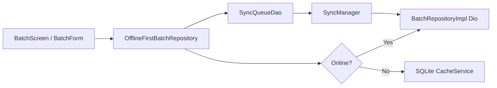

# Offline and sync

How offline behavior works today: **production batch sync** vs **offline_temp** prototype.

**See also:** [ARCHITECTURE.md](./ARCHITECTURE.md) · [FEATURES.md](./FEATURES.md)

---

## Two systems (do not confuse)

| System | Location | Status |
|--------|----------|--------|
| **Production offline-first** | `OfflineFirstBatchRepository`, `SyncManager`, `AppDatabase` | Batches only |
| **Offline temp module** | `lib/offline_temp/` | Prototype UI + separate DB; admin drawer entry |

---

## Production: batch offline-first

**Read path:** Online → API + refresh cache. Offline → read cached batches for current admin code.

**Write path:** Online → API immediately. Offline → enqueue `SyncQueueRecord` + optimistic local update where applicable.

**Registration:** `offlineFirstBatchRepository.registerSyncHandlers(syncManager)` in bootstrap.

---

## SyncManager

File: `lib/core/sync/sync_manager.dart`

| Behavior | Detail |
|----------|--------|
| Listens | `ConnectivityService.onOnlineStatusChanged` |
| On online | `syncPending()` processes queue |
| Handlers | Per `EntityType` — batches registered at startup |
| Retries | `maxRetries` (default 5); failed count tracked |
| UI | `ChangeNotifier` — `pendingCount`, `failedCount`, `isSyncing` |

---

## Admin drawer sync UI

`AppDrawer` → `_syncStatusBanner`:

- Shows pending/failed counts when `SyncManager.hasPendingWork`
- **Sync now** triggers manual sync

---

## Local storage (production)

| Component | Role |
|-----------|------|
| `AppDatabase` | SQLite singleton |
| `CacheService` | Entity cache by admin code |
| `SyncQueueDao` | Pending mutations |

Initialized in `main.dart` before `runApp`.

---

## Offline temp module

**Route:** `/offlineTempHome`

**UI:** Bottom tabs — Routes, Batches, Commuters, Output; FAB per tab; optional seed import / dump all.

**Data:** `OfflineTempDatabase`, `OfflineTempProvider` — local-only prototype for demos and planning (Phase 9: promote to production patterns).

**Redirect:** `OfflineAutoRedirect` on admin home, driver home, and offline screens reacts to connectivity (steer users when offline).

---

## Roadmap (from PROJECT_TODOS)

- Phase 9: Promote `offline_temp` patterns or merge into feature repositories
- Expand `EntityType` handlers beyond batches for full admin CRUD offline

---

## Developer checklist (offline change)

1. If touching batches: test airplane mode → create/edit → reconnect → drawer sync
2. Update sync handler registration if new entity types added
3. Document entity in this file and [FEATURES.md](./FEATURES.md)
