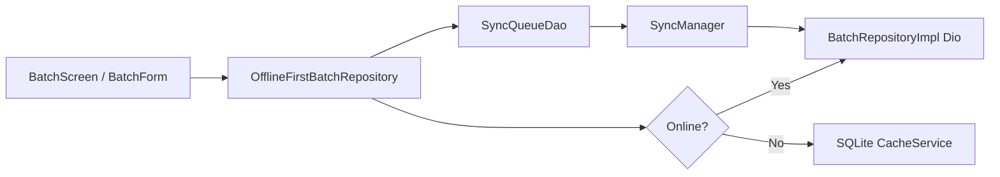

> **Doc:** docs/OFFLINE_AND_SYNC.md
> **Updated:** 2026-09-10 19:40 IST
> **Session:** Removed offline_temp prototype; prod batch sync unchanged

# Offline and sync

How offline behavior works today: **production batch sync** only.
The former `lib/offline_temp/` Offline Mode prototype (separate DB, drawer tile, seed data) was **removed**.

**See also:** [ARCHITECTURE.md](./ARCHITECTURE.md) · [FEATURES.md](./FEATURES.md)

---

## Production system

| System | Location | Status |
|--------|----------|--------|
| **Production offline-first** | `OfflineFirstBatchRepository`, `SyncManager`, `AppDatabase` | Batches only |

---

## Degraded network (P5 — production app)

Full offline queue/replay for live trips and return batches is **deferred**. Current behavior:

| Component | Role |
|-----------|------|
| `NetworkActionGuard` | Pre-check before D2D connect/WS actions and return batch confirm/remove/end |
| `NetworkDegradedBanner` | App-wide offline banner (MaterialApp builder) |
| `ConnectivityService.isOnlineCached` | Fast path for sync UI guards without re-probing |

**Extension point:** `NetworkActionPolicy.queueWhenOffline` reserved for future per-entity queue handlers (see `SyncManager` + batch registration today).

**Future offline scope (not P5):** queue/replay for return batch POSTs, D2D WS action replay, commuter intents, full admin CRUD offline beyond batches.

---

## Production: batch offline-first

**Read path:** Online → API + refresh cache. Offline → read cached batches for current admin code.

**Write path:** Online → API immediately. Offline → enqueue `SyncQueueRecord` + optimistic local update where applicable.

**Registration:** `offlineFirstBatchRepository.registerSyncHandlers(syncManager)` in bootstrap.

### Admin catalog luggage (bootstrap)

| Mode | Behavior |
|------|----------|
| Pull-to-refresh | Awaits full `sync()` / `invalidateAndResync` |
| Post-CRUD | `refreshInBackground()` — stale-while-revalidate; does **not** block the mutation UI |
| TTL | **None** — freshness is PTR + background refresh (FIND-011) |

See [API_CONTRACTS.md](./API_CONTRACTS.md) · [setup/ADMIN_BOOTSTRAP_DRAFT.md](./setup/ADMIN_BOOTSTRAP_DRAFT.md).

---

## SyncManager

File: `lib/core/sync/sync_manager.dart`

| Behavior | Detail |
|----------|--------|
| Listens | App-scoped `ConnectivityService` (one plugin listener; `isOnline` cached; events only on state change) |
| On online | `syncPending()` processes queue |
| Handlers | Per `EntityType` — batches registered at startup |
| Retries | `maxRetries` (default 5); failed count tracked |
| Unknown entity | No handler → mark failed at `maxRetries` (does not retry forever) |
| Dispose | `CtsApp.dispose` stops SyncManager then disposes `ConnectivityService`. SyncManager disposes connectivity only if it created it |

---

## Admin drawer sync UI

`AppDrawer` → `_syncStatusBanner`:

- Shows pending/failed counts when `SyncManager.hasPendingWork`
- **Sync now** triggers manual sync

---

## Local storage (production)

| Component | Role |
|-----------|------|
| `AppDatabase` | SQLite singleton |
| `CacheService` | Entity cache by admin code |
| `SyncQueueDao` | Pending mutations |

Initialized in `main.dart` before `runApp`.

---

## Roadmap (from PROJECT_TODOS)

- Expand `EntityType` handlers beyond batches for full admin CRUD offline

---

## Developer checklist (offline change)

1. If touching batches: test airplane mode → create/edit → reconnect → drawer sync
2. Update sync handler registration if new entity types added
3. Document entity in this file and [FEATURES.md](./FEATURES.md)
