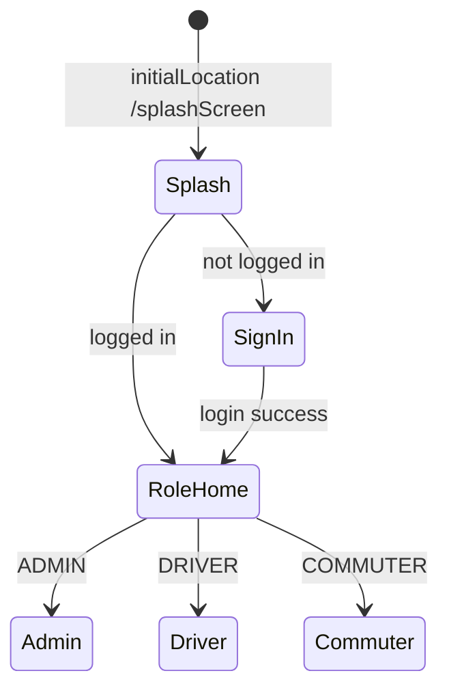

> **Doc:** docs/ROUTING_AND_AUTH.md
> **Updated:** 2026-08-20 22:15 IST
> **Session:** Verified unchanged

# Routing and authentication

How users move through the app: **go_router**, **session**, and **role-based access**.

**See also:** [UI_ARCHITECTURE.md](./UI_ARCHITECTURE.md) §1 · [FLOWS_BY_ROLE.md](./FLOWS_BY_ROLE.md)

---

## Key files

| File | Purpose |
|------|---------|
| `lib/app/router/app_router.dart` | `GoRouter` definition, redirects, builders |
| `lib/app/router/route_names.dart` | Path constants, role prefix sets |
| `lib/app/router/auth_redirect.dart` | Pure `resolveAuthRedirect()` — unit tested |
| `lib/app/router/session_auth_notifier.dart` | Login + role snapshot; optional server reconcile |
| `lib/app/session_invalidation.dart` | Shared 401/4401 handler — snackbar + `/signIn` |
| `lib/domain/usecases/get_initial_route_usecase.dart` | Post-splash destination |
| `lib/data/repositories/session_repository_impl.dart` | Persisted session |

---

## Bootstrap routing

1. **Splash** calls `SessionAuthNotifier.refresh(validateWithServer: true)` then `SplashProvider.determineInitialRoute()`.
2. **GetInitialRouteUseCase** returns `signIn` or `RouteName.homeForRole(userType)`.
3. Splash uses `context.go(route)`.

**Sign-in success** (`SignInScreen`): refreshes session, then `context.go` to admin / driver / commuter home.

---

## GoRouter redirect rules

Evaluated on navigation and when `SessionAuthNotifier` notifies (login/logout).

| Condition | Redirect |
|-----------|----------|
| Location is splash | Allow (session still resolving) |
| `!authNotifier.ready` | Allow (wait) |
| Location is `/signUp` | `/signIn` (public self-registration disabled) |
| Not logged in + not public route | `/signIn` |
| Logged in on `/signIn` | Role home |
| Path in `adminOnlyPrefixes` + user ≠ ADMIN | Role home |
| Path in `driverOnlyPrefixes` + user not DRIVER (ADMIN excluded from driver-only *home* paths) | Role home |
| Path in `commuterOnlyPrefixes` + user not COMMUTER (ADMIN excluded) | Role home |
| Otherwise | Allow |

**Note:** ADMIN can access admin routes and D2D **Channel**; ADMIN is redirected away from driver home and commuter home prefixes when hitting those URLs directly.

---

## Route prefix sets

Defined in `RouteName`:

| Set | Purpose |
|-----|---------|
| `public` | splash, signIn, signUp (redirects to sign-in), noInternet |
| `adminOnlyPrefixes` | Dashboard, CRUD, running/return batches, D2D channel |
| `driverOnlyPrefixes` | driver home, d2d log |
| `commuterOnlyPrefixes` | commuter home |

---

## Navigation API

| Action | When to use |
|--------|-------------|
| `context.go(path)` | Replace stack — logout, login success, role home |
| `context.push(path)` | Stack — drawer items, forms, D2D |
| `Navigator.push` | Nested flows not in GoRouter (commuter list by batch, some offline forms) |

Drawer closes then **`push`** (not `go`) so back returns to previous screen.

---

## Deep links and path parameters

| Route pattern | Parameter |
|---------------|-----------|
| `/d2dChannel/:batchId` | batch id |
| `/d2dLog/:batchId` | batch id |
| `/offlineBatchCommuters/:batchId` | int batch id |
| `/offlineRoutePops/:routeId` | int route id |

Fallback builders redirect to safe screens if params missing (e.g. empty batchId → running batches or driver home).

**Extra:** `D2dRouteArgs.batchIdFrom(state.extra)` for legacy named-route args.

---

## Session model

`SessionAuthNotifier`:

- `loggedIn` — `isLogin` **and** a non-empty `sessionid` in `SessionManager` (in-memory after first secure-storage read)
- `userType` — `ADMIN` | `DRIVER` | `COMMUTER` (string from session; reconciled with `GET /user/<id>` on startup via `refreshSessionFromServer()`)
- `ready` — first refresh completed

Router `refreshListenable: authNotifier` re-runs redirects when session changes. HTTP **401** (except login) and D2D WS **4401/4403** call `createSessionInvalidatedHandler`: clear local session, error snackbar, explicit `context.go(/signIn)`.

Public **sign-up is disabled**. `/signUp` redirects to `/signIn`. Admins create DRIVER/COMMUTER via CRUD. Backend `POST /user/` enforces COMMUTER-only for unauthenticated callers (P2).

---

## Logout flow

1. Profile or drawer → logout via `SignInProvider`
2. `POST /user/logout` (best-effort); **always** `AppManager.clearLocalSession()` (cookies + prefs) even if POST fails
3. `ControllerResetUtil.resetAllControllers(context)`
4. `SessionAuthNotifier.refresh()`
5. `context.go(RouteName.signIn)`

---

## Routes defined but not in GoRouter

Constants in `route_names.dart` only (use nested `Navigator`):

- `/commuterListScreen`
- `/returnCommuterScreen`
- `/confirmReturnCommuterList`

---

## Testing routing locally

1. Run debug app
2. Sign in as each role; verify drawer/admin CRUD blocked for driver/commuter
3. Deep link: `adb shell am start -a android.intent.action.VIEW -d "your-scheme://d2dLog/123"` (if intent filters configured) or use in-app START TRIP
