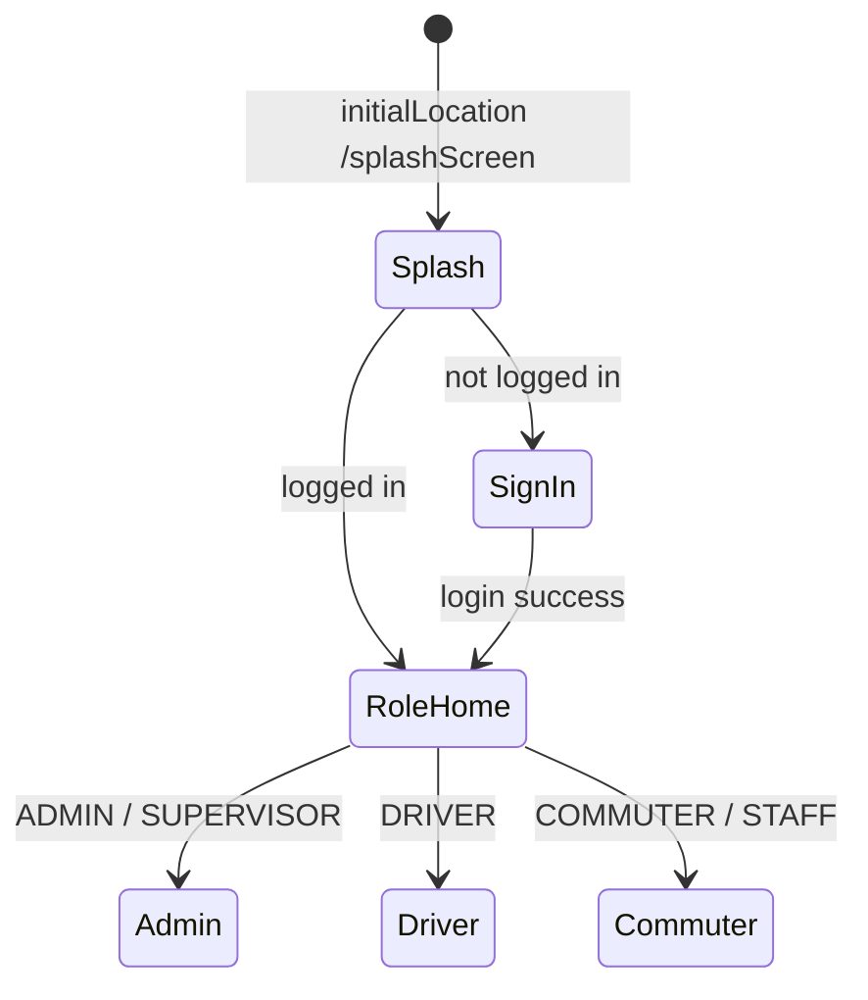

> **Doc:** docs/ROUTING_AND_AUTH.md
> **Updated:** 2026-09-09 19:50 IST
> **Session:** SUPER_ADMIN + web /void/ portal note

# Routing and authentication

How users move through the app: **go_router**, **session**, and **role-based access**.

**See also:** [UI_ARCHITECTURE.md](./UI_ARCHITECTURE.md) §1 · [FLOWS_BY_ROLE.md](./FLOWS_BY_ROLE.md)

---

## Key files

| File | Purpose |
|------|---------|
| `lib/app/router/app_router.dart` | `GoRouter` definition, redirects, builders |
| `lib/app/router/route_names.dart` | Path constants, role prefix sets, `homeForRole` / `isAdminLike` / `isCommuterLike` |
| `lib/app/router/admin_service.dart` | `AdminService` enum + `AdminCapabilities` (dashboard / drawer / guards) |
| `lib/app/router/auth_redirect.dart` | Pure `resolveAuthRedirect()` — unit tested |
| `lib/app/router/session_auth_notifier.dart` | Login + role snapshot; optional server reconcile |
| `lib/app/session_invalidation.dart` | Shared 401/4401 handler — snackbar + `/signIn` |
| `lib/domain/usecases/get_initial_route_usecase.dart` | Post-splash destination |
| `lib/data/repositories/session_repository_impl.dart` | Persisted session |

---

## User roles (homes)

| `userType` | Home route | Admin shell? |
|------------|------------|--------------|
| `ADMIN` | `/adminHomeScreen` | Yes — **all** `AdminService` tiles |
| `SUPER_ADMIN` | `/adminHomeScreen` | Yes — **all** tiles (same as ADMIN); **web portal** = Django `/void/` (staff/superuser) |
| `SUPERVISOR` | `/adminHomeScreen` (shared shell, filtered) | Yes — **allow-list only** |
| `STAFF` | `/commuterHomeScreen` | No (same UX as COMMUTER) |
| `DRIVER` | `/driverHomeScreen` | No |
| `COMMUTER` | `/commuterHomeScreen` | No |

**Decision:** No separate “supervisor home” screen — SUPERVISOR uses the admin dashboard with capability filtering. STAFF is **not** in `isAdminLike`.  
**Web:** There is no separate Flutter web admin app yet (sqflite). Org / schema management for now uses Django admin at `/void/` as **SUPER_ADMIN** (`is_staff` + `is_superuser`). Mobile ADMIN/SUPERVISOR stay on the Flutter app.

---

## AdminService allow-list (Phase A)

Central enum in `lib/app/router/admin_service.dart` (web-ready: same gates for future web layouts).

| Enum value | Covers (routes) |
|------------|-----------------|
| `batch` | batch / running / return batch + forms |
| `cab` | cab list + form |
| `route` | route list + form |
| `pop` | POP list + form |
| `driver` | driver list + form |
| `d2d` | `/d2dChannel/:batchId` (day-ops DTODLOG monitor) |
| `commuter` | commuter list + form |

- **ADMIN** → `AdminCapabilities.all`
- **SUPERVISOR** → `AdminCapabilities.supervisorAllowList` = `{batch, cab, route, pop, driver, d2d, commuter}`
- **Not included for SUPERVISOR:** offline temp drawer, org billing / org-delete / other full-admin-only tools (when added)

Dashboard overview tiles, quick actions, drawer MANAGEMENT links, and `resolveAuthRedirect` all consult `AdminCapabilities`.

---

## Bootstrap routing

1. **Splash** calls `SessionAuthNotifier.refresh(validateWithServer: true)` then `SplashProvider.determineInitialRoute()`.
2. **GetInitialRouteUseCase** returns `signIn` or `RouteName.homeForRole(userType)`.
3. Splash uses `context.go(route)`.

**Sign-in success** (`SignInScreen`): refreshes session, then `context.go` via `RouteName.homeForRole`.

---

## GoRouter redirect rules

Evaluated on navigation and when `SessionAuthNotifier` notifies (login/logout).

| Condition | Redirect |
|-----------|----------|
| Location is splash | Allow (session still resolving) |
| `!authNotifier.ready` | Allow (wait) |
| Location is `/signUp` | `/signIn` (public self-registration disabled) |
| Not logged in + not public route | `/signIn` |
| Logged in on `/signIn` | Role home |
| Path in `adminOnlyPrefixes` + `!AdminCapabilities.canAccessAdminLocation` | Role home |
| Path in `driverOnlyPrefixes` + user not DRIVER (admin-like excluded) | Role home |
| Path in `commuterOnlyPrefixes` + user not commuter-like (admin-like excluded) | Role home |
| Otherwise | Allow |

**Notes:**
- `isAdminLike` = `ADMIN` \| `SUPER_ADMIN` \| `SUPERVISOR`.
- `isCommuterLike` = `COMMUTER` \| `STAFF`.
- SUPERVISOR blocked from a non-allow-listed admin path redirects to admin home.
- STAFF blocked from admin paths redirects to commuter home.
- ADMIN / SUPER_ADMIN / SUPERVISOR may still open driver-only prefixes (monitor); they are redirected away from treating those as home.

---

## Route prefix sets

Defined in `RouteName`:

| Set | Purpose |
|-----|---------|
| `public` | splash, signIn, signUp (redirects to sign-in), noInternet |
| `adminOnlyPrefixes` | Dashboard, CRUD, running/return batches, D2D channel |
| `driverOnlyPrefixes` | driver home, d2d log, driver return list, **return boarding QR show** |
| `commuterOnlyPrefixes` | commuter home, track cab, boarding scan, **return boarding scan alias** |

Return QR UI prep (no new BE): [setup/RETURN_QR_UI_PREP.md](./setup/RETURN_QR_UI_PREP.md).

---

## JWT login profile stub (role allowList)

`AuthenticationRepositoryImpl._applyOptionalProfileStub` accepts optional `profile` keys by role:

| Role | Profile keys applied |
|------|----------------------|
| `COMMUTER` / `STAFF` / `DRIVER` | `batchId`, `cabId`; `isComing` for commuter-like; nested `adminCode` |
| `ADMIN` / `SUPER_ADMIN` / `SUPERVISOR` | `subAdminId` / `supervisorId` / profile `id` → `adminCode` when envelope empty |

Empty org arrays / null profile stubs remain valid Phase A login responses ([API_CONTRACTS.md](./API_CONTRACTS.md)).

---

## Navigation API

| Action | When to use |
|--------|-------------|
| `context.go(path)` | Replace stack — logout, login success, role home |
| `context.push(path)` | Stack — drawer items, forms, D2D |
| `Navigator.push` | Nested flows not in GoRouter (commuter list by batch, some offline forms) |

Drawer closes then **`push`** (not `go`) so back returns to previous screen.

---

## Deep links and path parameters

| Route pattern | Parameter |
|---------------|-----------|
| `/d2dChannel/:batchId` | batch id |
| `/d2dLog/:batchId` | batch id |
| `/offlineBatchCommuters/:batchId` | int batch id |
| `/offlineRoutePops/:routeId` | int route id |

Fallback builders redirect to safe screens if params missing (e.g. empty batchId → running batches or driver home).

**Extra:** `D2dRouteArgs.batchIdFrom(state.extra)` for legacy named-route args.

---

## Session model

`SessionAuthNotifier`:

- `loggedIn` — `isLogin` **and** a non-empty JWT `access` token in `SessionManager` (FlutterSecureStorage)
- `userType` — `ADMIN` | `SUPER_ADMIN` | `SUPERVISOR` | `STAFF` | `DRIVER` | `COMMUTER` (from login `user.userType`; reconciled with `GET /user/<id>` on startup via `refreshSessionFromServer()`)
- `ready` — first refresh completed

Router `refreshListenable: authNotifier` re-runs redirects when session changes. HTTP **401** (after failed JWT refresh) and D2D WS **4401/4403** call `createSessionInvalidatedHandler`: clear local session, error snackbar, explicit `context.go(/signIn)`.

Public **sign-up is disabled**. `/signUp` redirects to `/signIn`. Admins create DRIVER/COMMUTER via CRUD. Backend `POST /user/` enforces COMMUTER-only for unauthenticated callers (P2).

---

## Logout flow

1. Profile or drawer → logout via `SignInProvider`
2. `POST /user/logout` (best-effort); **always** `AppManager.clearLocalSession()` (JWT + prefs) even if POST fails
3. `ControllerResetUtil.resetAllControllers(context)`
4. `SessionAuthNotifier.refresh()`
5. `context.go(RouteName.signIn)`

---

## Routes defined but not in GoRouter

Constants in `route_names.dart` only (use nested `Navigator`):

- `/commuterListScreen`
- `/returnCommuterScreen`
- `/confirmReturnCommuterList`

---

## Testing routing locally

1. Run debug app
2. Sign in as each role; verify STAFF → commuter home; SUPERVISOR → filtered admin shell; ADMIN → full tiles
3. Deep link: `adb shell am start -a android.intent.action.VIEW -d "your-scheme://d2dLog/123"` (if intent filters configured) or use in-app START TRIP
