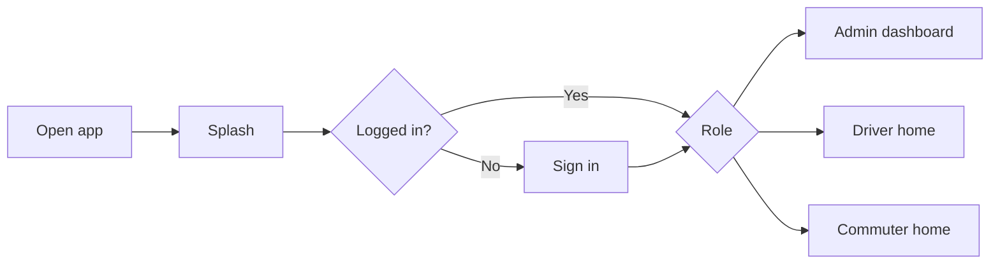

> **Doc:** docs/START_HERE.md
> **Updated:** 2026-08-20 23:40 IST
> **Session:** Wireframes removed — point to FLOWS + UI_ARCHITECTURE

# Start here

**Who you are** → **What to read** → **Run the app for real layouts**

This guide is for anyone new to the CTS (c2s) mobile app—product, design, QA, or development.

---

## 1. Pick your path

| I am… | Read first | Then | See layouts |
|--------|------------|------|-------------|
| **Product / PM** | [FLOWS_BY_ROLE.md](./FLOWS_BY_ROLE.md) | [guides/ADMIN_USER_GUIDE.md](./guides/ADMIN_USER_GUIDE.md) | Run app + role accounts ([LOCAL_DEV.md](./LOCAL_DEV.md)) |
| **Designer** | [FLOWS_BY_ROLE.md](./FLOWS_BY_ROLE.md) | [UI_ARCHITECTURE.md](./UI_ARCHITECTURE.md) | Live app (debug/release) |
| **New developer** | [CODE_MAP.md](./CODE_MAP.md) | [ARCHITECTURE.md](./ARCHITECTURE.md) → [FEATURES.md](./FEATURES.md) | `flutter run` |
| **QA** | [FLOWS_BY_ROLE.md](./FLOWS_BY_ROLE.md) · [TESTING.md](./TESTING.md) | [UI_ARCHITECTURE.md](./UI_ARCHITECTURE.md) | Device smoke per [TESTING.md](./TESTING.md) |

Full doc index: [README.md](./README.md)

### Documentation packs (all published)

| Pack | Docs |
|------|------|
| **P1 Architecture** | [ARCHITECTURE.md](./ARCHITECTURE.md) · [ROUTING_AND_AUTH.md](./ROUTING_AND_AUTH.md) · [FEATURES.md](./FEATURES.md) |
| **P2 Operations** | [OFFLINE_AND_SYNC.md](./OFFLINE_AND_SYNC.md) · [BUILD_AND_RELEASE.md](./BUILD_AND_RELEASE.md) · [TESTING.md](./TESTING.md) · [API_AND_ENV.md](./API_AND_ENV.md) |
| **P3 Guides & visuals** | [guides/](./guides/) · [SCREENSHOTS.md](./SCREENSHOTS.md) · [UI_ARCHITECTURE.md](./UI_ARCHITECTURE.md) |

---

## 2. The app in one minute

- **Flutter** app for **iOS & Android**.
- **Three roles:** Admin (manage transport), Driver (run trips), Commuter (mark “coming today”). Accounts are created by an **admin**, not a public sign-up screen.
- **Navigation:** `go_router` with login guards ([`lib/app/router/app_router.dart`](../lib/app/router/app_router.dart)).
- **State:** Provider (`ChangeNotifier`) wired in [`lib/app/app_providers.dart`](../lib/app/app_providers.dart).
- **UI building blocks:** [`lib/widgets/`](../lib/widgets/) (drawer, dashboard shell, lists, forms).

---

## 3. Folder map (simple)

| Folder | What lives here |
|--------|------------------|
| `lib/app/` | App entry, theme, router, dependency injection |
| `lib/features/*/` | One folder per feature (screens + providers + data) |
| `lib/widgets/` | Reusable UI (drawer, buttons, list cards) |
| `docs/` | You are here |

Details: [CODE_MAP.md](./CODE_MAP.md).

---

## 4. See layouts

Use the real app with lab accounts from [LOCAL_DEV.md](./LOCAL_DEV.md). Screen structure notes: [UI_ARCHITECTURE.md](./UI_ARCHITECTURE.md). Role click-paths: [FLOWS_BY_ROLE.md](./FLOWS_BY_ROLE.md).

---

## 5. Keep docs updated

When you change routes, roles, or major screens, update:

1. [UI_ARCHITECTURE.md](./UI_ARCHITECTURE.md) navigation table  
2. [FLOWS_BY_ROLE.md](./FLOWS_BY_ROLE.md) if the click path changed  
3. [CODE_MAP.md](./CODE_MAP.md) if files moved  
4. Session sync set via [DOC_REGISTRY.md](../DOC_REGISTRY.md)
