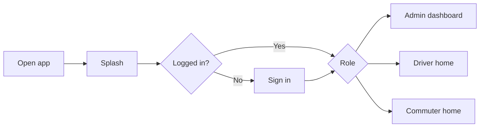

> **Doc:** docs/START_HERE.md
> **Updated:** 2026-08-25 22:05 IST
> **Session:** FLOWS owns QR/KM journeys

# Start here

**Who you are** → **What to read** → **Run the app for real layouts**

---

## 1. Pick your path

| I am… | Read first | Then | See layouts |
|--------|------------|------|-------------|
| **Agent / continuing chat** | [PROJECT_BRAIN.md](../PROJECT_BRAIN.md) → [PROMPT_SCOPE.md](../PROMPT_SCOPE.md) | [client_req/DISCUSSION_LOG](./client_req/DISCUSSION_LOG.md) · [FLOWS_BY_ROLE](./FLOWS_BY_ROLE.md) | [TESTING.md](./TESTING.md) + [LOCAL_DEV.md](./LOCAL_DEV.md) |
| **Product / PM** | [FLOWS_BY_ROLE.md](./FLOWS_BY_ROLE.md) (QR/KM morning) | [client_req/05](./client_req/05-open-decisions.md) · [FEATURES.md](./FEATURES.md) | Lab accounts in LOCAL_DEV |
| **Designer** | [FLOWS_BY_ROLE.md](./FLOWS_BY_ROLE.md) | [UI_ARCHITECTURE.md](./UI_ARCHITECTURE.md) | Live app |
| **New developer** | [CODE_MAP.md](./CODE_MAP.md) | [ARCHITECTURE.md](./ARCHITECTURE.md) → [FEATURES.md](./FEATURES.md) | `flutter run` |
| **QA** | [FLOWS_BY_ROLE.md](./FLOWS_BY_ROLE.md) · [TESTING.md](./TESTING.md) | [UI_ARCHITECTURE.md](./UI_ARCHITECTURE.md) | Device smoke |

Full index: [README.md](./README.md)

### Documentation packs

| Pack | Docs |
|------|------|
| **P1 Architecture** | ARCHITECTURE · ROUTING_AND_AUTH · FEATURES |
| **P2 Operations** | OFFLINE_AND_SYNC · BUILD_AND_RELEASE · TESTING · API_AND_ENV · LOCAL_DEV · API_CONTRACTS |
| **P3 Journeys** | FLOWS_BY_ROLE (incl. QR/KM) · UI_ARCHITECTURE |

**Owners:** LOCAL_DEV = Docker/LAN · API_CONTRACTS = wire · d2d/batches READMEs = feature behavior · FLOWS = operator paths · 05 = product story/locks · DISCUSSION_LOG = handoff pointer · 07 = smoke script. Do not recreate `backend/01–04` or `guides/`.

---

## 2. The app in one minute

- **Flutter** app for **iOS & Android**.
- **Three roles:** Admin (manage transport), Driver (run trips), Commuter (mark “coming today”). Accounts are created by an **admin**, not a public sign-up screen.
- **Navigation:** `go_router` with login guards ([`lib/app/router/app_router.dart`](../lib/app/router/app_router.dart)).
- **State:** Provider (`ChangeNotifier`) wired in [`lib/app/app_providers.dart`](../lib/app/app_providers.dart).
- **UI building blocks:** [`lib/widgets/`](../lib/widgets/) (drawer, dashboard shell, lists, forms).

---

## 3. Folder map (simple)

| Folder | What lives here |
|--------|------------------|
| `lib/app/` | App entry, theme, router, dependency injection |
| `lib/features/*/` | One folder per feature (screens + providers + data) |
| `lib/widgets/` | Reusable UI (drawer, buttons, list cards) |
| `docs/` | You are here |

Details: [CODE_MAP.md](./CODE_MAP.md).

---

## 4. See layouts

Use the real app with lab accounts from [LOCAL_DEV.md](./LOCAL_DEV.md). Screen structure notes: [UI_ARCHITECTURE.md](./UI_ARCHITECTURE.md). Role click-paths: [FLOWS_BY_ROLE.md](./FLOWS_BY_ROLE.md).

---

## 5. Keep docs updated

When you change routes, roles, or major screens, update:

1. [UI_ARCHITECTURE.md](./UI_ARCHITECTURE.md) navigation table  
2. [FLOWS_BY_ROLE.md](./FLOWS_BY_ROLE.md) if the click path changed  
3. [CODE_MAP.md](./CODE_MAP.md) if files moved  
4. Session sync set via [DOC_REGISTRY.md](../DOC_REGISTRY.md)
