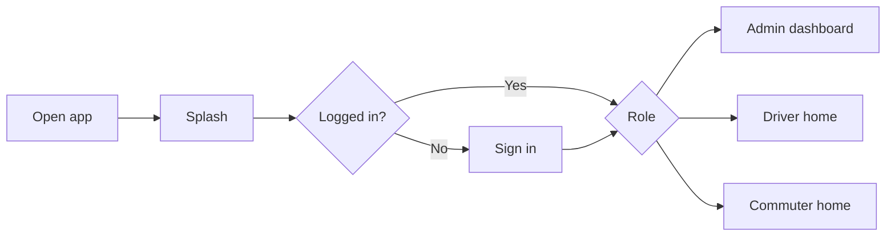

# Start here

**Who you are** → **What to read** → **Optional: see layouts in the app**

This guide is for anyone new to the CTS (c2s) mobile app—product, design, QA, or development.

---

## 1. Pick your path

| I am… | Read first | Then | Try in app (debug) |
|--------|------------|------|---------------------|
| **Product / PM** | [FLOWS_BY_ROLE.md](./FLOWS_BY_ROLE.md) | [guides/ADMIN_USER_GUIDE.md](./guides/ADMIN_USER_GUIDE.md) | [Wireframe gallery](./WIREFRAME_GALLERY.md) |
| **Designer** | [FLOWS_BY_ROLE.md](./FLOWS_BY_ROLE.md) | [UI_ARCHITECTURE.md](./UI_ARCHITECTURE.md) §3 · [SCREENSHOTS.md](./SCREENSHOTS.md) | Wireframe gallery |
| **New developer** | [CODE_MAP.md](./CODE_MAP.md) | [ARCHITECTURE.md](./ARCHITECTURE.md) → [FEATURES.md](./FEATURES.md) | Run app → wireframes link |
| **QA** | [FLOWS_BY_ROLE.md](./FLOWS_BY_ROLE.md) · [TESTING.md](./TESTING.md) | [UI_ARCHITECTURE.md](./UI_ARCHITECTURE.md) | Role test accounts |

Full doc index: [README.md](./README.md) (P1–P3 complete; screenshots PNGs optional).

---

## 2. The app in one minute

- **Flutter** app for **iOS & Android**.
- **Three roles:** Admin (manage transport), Driver (run trips), Commuter (mark “coming today”).
- **Navigation:** `go_router` with login guards ([`lib/app/router/app_router.dart`](../lib/app/router/app_router.dart)).
- **State:** Provider (`ChangeNotifier`) wired in [`lib/app/di/app_providers.dart`](../lib/app/di/app_providers.dart).
- **UI building blocks:** [`lib/shared/widgets/`](../lib/shared/widgets/) (drawer, dashboard shell, lists, forms).

---

## 3. Folder map (simple)

| Folder | What lives here |
|--------|------------------|
| `lib/app/` | App entry, theme, router, dependency injection |
| `lib/features/*/` | One folder per feature (screens + providers + data) |
| `lib/shared/widgets/` | Reusable UI (drawer, buttons, list cards) |
| `lib/design/wireframes/` | Debug layout previews (no API) |
| `docs/` | You are here |

Details: [CODE_MAP.md](./CODE_MAP.md).

---

## 4. Wireframe gallery (debug builds)

No login required in **debug** mode:

1. Run the app (`flutter run`).
2. On the **Sign in** screen, tap **Preview UI wireframes (debug)**,  
   **or** open route `/designWireframes`.

See [WIREFRAME_GALLERY.md](./WIREFRAME_GALLERY.md).

---

## 5. Keep docs updated

When you change routes, roles, or major screens, update:

1. [UI_ARCHITECTURE.md](./UI_ARCHITECTURE.md) navigation table  
2. [FLOWS_BY_ROLE.md](./FLOWS_BY_ROLE.md) if user journeys change  
3. [wireframe_catalog.dart](../lib/design/wireframes/wireframe_catalog.dart) if layout patterns change  
