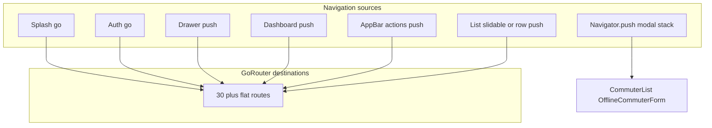
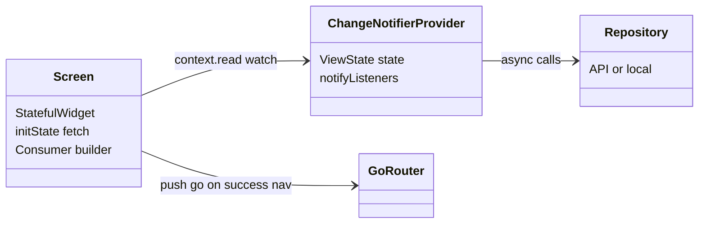
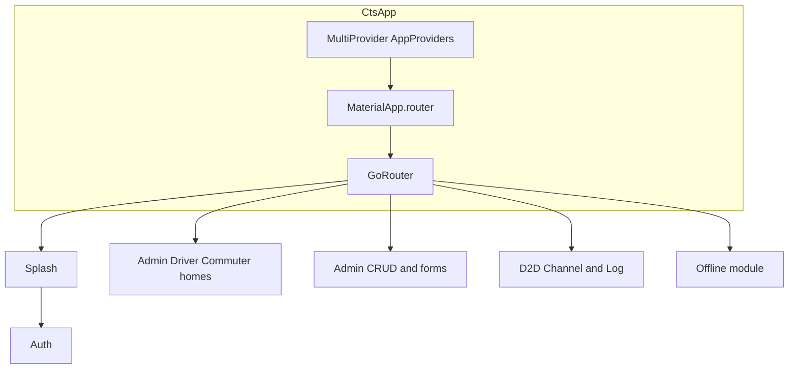
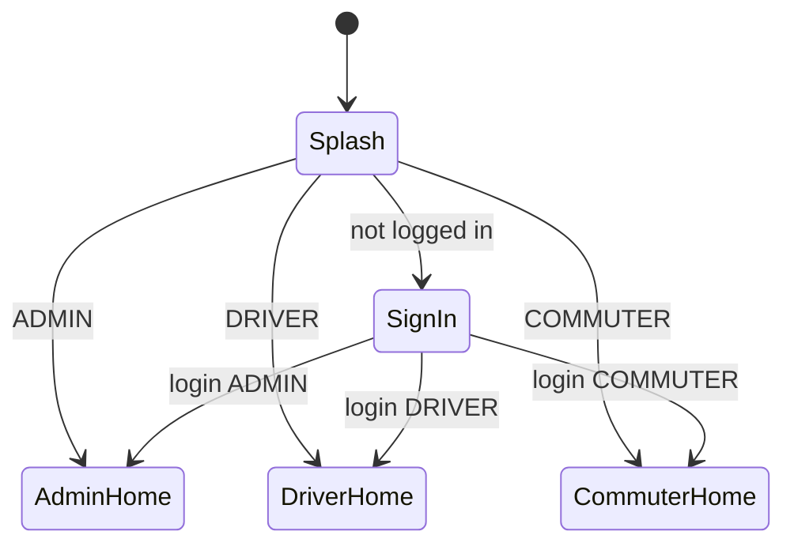
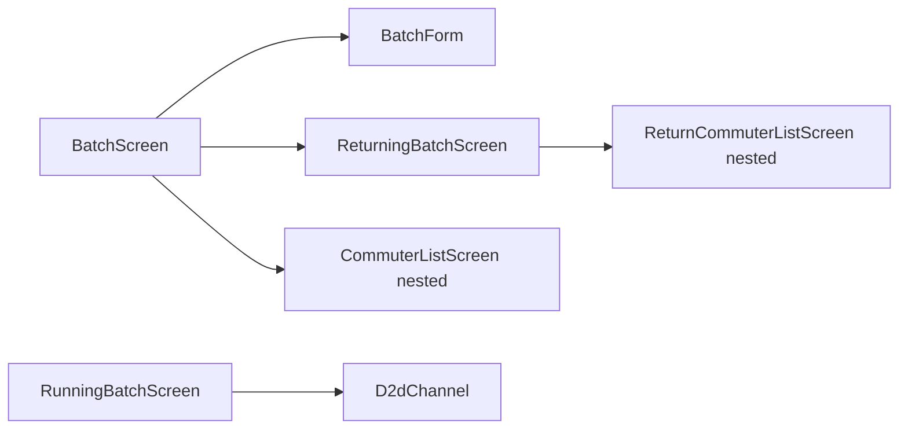

> **Doc:** docs/UI_ARCHITECTURE.md
> **Updated:** 2026-09-15 22:35 IST
> **Session:** D2D cream shared body note (Admin + Driver)

# CTS Mobile App — UI, Navigation, Wireframes & Controls

> Easier entry: [START_HERE.md](./START_HERE.md) · Role flows (QR/KM): [FLOWS_BY_ROLE.md](./FLOWS_BY_ROLE.md)

Reference for the **current** Flutter codebase (Commuter Transport System / c2s).

**Sources:** `lib/app/router/app_router.dart`, `lib/app/router/route_names.dart`, `lib/app/app_providers.dart`, feature `screens/` / `providers/` / `repositories/`.

**Index:** [README.md](./README.md)

---

## 1. Complete navigation matrix

Every **registered** GoRouter destination plus **nested** `Navigator.push` screens.

| # | Destination | Route / mechanism | Who can open | Entry points |
|---|-------------|-------------------|--------------|--------------|
| 1 | SplashScreen | `/splashScreen` | All | App launch |
| 2 | SignInScreen | `/signIn` | Public | Splash, redirect when logged out, logout |
| 3 | (redirect) | `/signUp` | Public path only | Redirects to `/signIn` — public register is disabled |
| 4 | NoInternetError | `/noInternet` | Public | Connectivity flows (legacy) |
| 5 | AdminMainScreen | `/adminHomeScreen` | ADMIN (+ redirect) | Splash/login, drawer Dashboard, stat taps stay on hub |
| 6 | DriverHomePage | `/driverHomeScreen` | DRIVER, ADMIN blocked from prefix* | Splash/login |
| 7 | CommuterHomePage | `/commuterHomeScreen` | COMMUTER | Splash/login |
| 8 | ProfileScreen | `/profileScreen` | Logged-in (drawer) | Drawer Profile; logout on profile |
| 9 | RouteScreen | `/routeScreen` | ADMIN | Drawer, dashboard compact card |
| 10 | RouteForm | `/routeForm` | ADMIN | Route list FAB/slidable edit, quick action |
| 11 | PopScreen | `/popScreen` | ADMIN | Drawer, dashboard |
| 12 | PopForm | `/popForm` | ADMIN | POP list, quick action |
| 13 | BatchScreen | `/batchScreen` | ADMIN | Drawer, dashboard Batches stat |
| 14 | BatchForm | `/batchForm` | ADMIN | Batch AppBar +, slidable edit, quick action |
| 15 | ReturningBatchScreen | `/returnBatchScreen` | ADMIN | Batch AppBar return icon, dashboard quick action |
| 16 | RunningBatchScreen | `/runningBatchScreen` | ADMIN | Quick action; D2D fallback |
| 17 | CabScreen / CabForm | `/cabScreen`, `/cabForm` | ADMIN | Drawer, dashboard, list actions |
| 18 | DriverScreen / DriverForm | `/driverScreen`, `/driverForm` | ADMIN | Drawer, dashboard, list actions |
| 19 | CommuterScreen / CommuterForm | `/commuterScreen`, `/commuterForm` | ADMIN | Drawer, dashboard, list actions |
| 20 | D2dChannel | `/d2dChannel/:batchId` | ADMIN / SUPERVISOR (+ SUPER_ADMIN monitor) | Running batch card — cream live log; **no** QR; Add if operator |
| 21 | D2DLogScreen | `/d2dLog/:batchId` | DRIVER | Driver START TRIP — cream body + KM + QR + CList; **no Add** |
| 21b | BoardingScanScreen | `/boardingScan` | COMMUTER / STAFF | Commuter home **Scan** — camera → `boardingScan` API |
| 21c | ReturnBoardingScanScreen | `/returnBoardingScan` | COMMUTER / STAFF | Return scan → shared boarding_scan (token leg=return) |
| 22 | ReturnCommuterListScreen | `/returnCommuterScreen/:batchId` | ADMIN | Return batch picker row |
| 23 | ReturnCommuterListScreen (confirm/remove) | `/driverReturnCommuter/:batchId` | DRIVER | Driver home RETURN LIST + **BOARDING QR** |
| 23b | ReturnBoardingQrScreen | `/returnBoardingQr/:batchId` | DRIVER (+ admin-like) | Return QR show — mint `?trip=return` |
| 28 | CommuterListScreen | `Navigator.push` | ADMIN | Batch list row → commuters for batch |
| 29 | Router error | `errorBuilder` | — | Unknown deep link |

\*GoRouter `driverOnlyPrefixes` sends non-drivers away from `/driverHomeScreen`, `/d2dLog`, and `/driverReturnCommuter`. ADMIN uses admin home but can open D2D **Channel**.

**Drawer behavior** (`lib/widgets/app_drawer.dart`): closes drawer → `context.push(route)` (stack, not `go`). Sync banner + “Sync now” when `SyncManager` pending. Logout → `context.go(signIn)`.

**Constants not in GoRouter** (`route_names.dart` only): `/commuterListScreen`, `/confirmReturnCommuterList` — nested Navigator instead. `/returnCommuterScreen/:batchId` and `/driverReturnCommuter/:batchId` **are** GoRoutes.



---

## 2. Feature views and controls (Screen → Provider → actions)

Shared UI state: `ViewState` — `idle | loading | success | error` (`lib/appManager/view_state.dart`). Most list screens: `Consumer<Controller>` + local `_searchQuery` in `State`.

| Feature | View (screen) | Control (Provider) | Repository / service | User controls → provider methods |
|---------|---------------|--------------------|----------------------|----------------------------------|
| Splash | SplashScreen | SplashProvider | GetInitialRouteUseCase → SessionRepository | Auto: `determineInitialRoute()` → `context.go` |
| Session | (redirect only) | SessionAuthNotifier | SessionRepositoryImpl | `refresh()` on login/logout |
| Auth sign-in | SignInScreen | SignInProvider | AuthenticationRepository | Mobile/password fields → login; logout from profile |
| Auth sign-up | `/signUp` redirect | — | AuthenticationRepository.signUp refuses public ADMIN | Deep links go to sign-in |
| Admin dashboard | AdminMainScreen | AdminProvider | Batch, Commuter, Driver, Cab, Route, Pop, RunningBatch repos | Pull refresh → `loadDetailedDashboardData()`; Add * → `*FormProvider.clearAll()` then `push`; stats → list routes |
| Routes | RouteScreen, RouteForm | RouteController, RouteFormProvider | RouteRepository | `fetchRoutes`, `deleteRoute`; create/update; edit/delete pass `RouteModel` |
| POPs | PopScreen, PopForm | PopProvider, PopFormProvider | PopRepository | Same CRUD pattern |
| Batches | BatchScreen, BatchForm | BatchProvider, BatchFormProvider | OfflineFirstBatchRepository | `fetchBatches`, delete; form dates/times |
| Running batches | RunningBatchScreen | RunningBatchProvider | RunningBatchRepository | `fetchOnce` on open/resume/return-from-D2D; card → D2D Channel; trip-ended WS → one snapshot |
| Return batches | ReturningBatchScreen, ReturnCommuterListScreen | ReturnBatchProvider | ReturnBatchRepository | `fetchStatusesForBatches` (status); `loadReturnTrip` (view + get_commuter); confirm/remove (admin + driver); end REST (admin) |
| Cabs | CabScreen, CabForm | CabProvider, CabFormProvider | CabRepository | CRUD |
| Drivers (admin) | DriverScreen, DriverForm | DriverProvider, DriverFormProvider | DriverRepository | CRUD |
| Driver home | DriverHomePage | DriverHomeProvider | DriverRepository | `fetchDriverProfile`; START TRIP; RETURN LIST |
| Commuters (admin) | CommuterScreen, CommuterForm, CommuterListScreen | CommuterController, CommuterFormProvider | CommuterRepository | CRUD; form pop/`create`/`update` call `refreshCurrentList` (by-batch vs all); swipe-edit passes `CommuterModel`; Coming switch → `updateCommuterIsComing`; AppBar Mark all coming → `markAllComing` |
| Commuter home | CommuterHomePage | CommuterHomeProvider | CommuterRepository | `fetchCommuterProfile`; Switch → `updateIsComing` + dialog |
| D2D admin | D2dChannel | D2dChannelProvider | WebSocket + cream body | `connect`, Board/Remove, Add (ADMIN/SUPERVISOR), Call Driver, KM, FAB close = disconnect not STOP |
| D2D driver | D2DLogScreen | D2dChannelProvider (shared) | Same cream body | `fetchTripStatus`, `connect`, QR, **no Add**, **STOP TRIP**, dispose disconnect; other-batch red + beeps |
| Profile | ProfileScreen | ProfileProvider, SignInProvider (logout) | Session + AuthenticationRepository | `load()` session fields; confirm logout → reset controllers, session refresh |
| Sync | Drawer banner | SyncManager | Connectivity + queue | Manual sync button |



**Form control pattern** (all `*Form` screens): `*FormProvider` holds `TextEditingController`s + `forUpdate`/`updateId`. Providers are **app-scoped** — dashboard Add and list **+** must `clearAll()` before `push` so create does not inherit the last edit. Submit calls `*Controller` or repository via provider; `DashboardShell` + `AdminFormHeader` + `PopScope` refresh list on pop.

**List control pattern**: `SearchBarWidget` → local filter (often A–Z sorted). `Slidable` edit prefills form provider from the **row model** (not the unsorted provider index) → `push(*Form)`; delete → `ConfirmationDialog` → controller delete.

---

## 3. ASCII wireframes (by screen type)

### 3.1 Auth — SignInScreen

```
+----------------------------------+
|           [status bar]           |
|         [logo / Welcome]         |
|  +----------------------------+  |
|  | Mobile                     |  |
|  +----------------------------+  |
|  +----------------------------+  |
|  | Password            [eye]  |  |
|  +----------------------------+  |
|  [ ======== LOGIN ========== ]   |
+----------------------------------+
```

### 3.2 Admin — DashboardShell + AdminMainScreen

```
+--Drawer--+--------------------------------+
| [avatar] | [=] Dashboard          [actions]|
| Dashboard| Welcome + date                 |
| Profile  | +----------+ +----------+      |
| -------- | | Batches  | | Commuters|      |
| MGMT     | +----------+ +----------+      |
| Commuters| [Routes][POPs][Cabs][Drivers]  |
| POPs     | Quick Actions (2x4 grid)       |
| Batches  | [Add Batch][Add Commuter]...   |
| ...      |                                |
| Logout   |                                |
+----------+--------------------------------+
Desktop: permanent 250px nav column replaces drawer.
```

### 3.3 Admin — CRUD list (RouteScreen template)

```
+----------------------------------+
| [=] Routes              [+]      |
+----------------------------------+
| All Routes                       |
| [======== Search ========]       |
| +------------------------------+ |
| | Route A          [<- swipe ->| |
| +------------------------------+ |
| | Route B                      | |
| +------------------------------+ |
+----------------------------------+
FAB optional; Batch screen uses AppBar [return][+] instead.
```

### 3.4 Admin — Form (RouteForm template)

```
+----------------------------------+
| [=] Create Route                 |
+----------------------------------+
| (icon) Create New Route          |
| +----------------------------+   |
| | Route Name                 |   |
| +----------------------------+   |
| [ Cancel ]  [ Save / Update ]    |
+----------------------------------+
```

### 3.5 Driver — DriverHomePage

```
+----------------------------------+
| [=]  BrandAppBar                 |
+----------------------------------+
|        +------------------+      |
|        | Date       [call]|      |
|        | Batch | Time | Cab|      |
|        +------------------+      |
|                                  |
|     [ ===== START TRIP ===== ]   |
+----------------------------------+
```

### 3.6 Driver — D2DLogScreen

Shared cream body (`D2dCreamTripBody`): LIVE COMMUTER LOG, batch, boarding QR, counts, riders search/sort, Board/Remove. **No Add.** Bottom **STOP TRIP**. Other-batch rows red; board beeps on Already IN.

```
+----------------------------------+
| [=] BrandAppBar  LIVE  CALL      |
+----------------------------------+
| LIVE COMMUTER LOG · TRIP ACTIVE  |
| Batch name                       |
| [ Boarding QR ]                  |
| Remaining | Waiting | On board   |
| Riders [search] [Asc/Desc]       |
| rider rows (Board / call)        |
|======== STOP TRIP ===============|
+----------------------------------+
```

### 3.7 Admin — D2dChannel (same cream stack; separate screen)

Same cream composition as driver. **No QR.** Add (ADMIN/SUPERVISOR). Call Driver. KM. Close channel FAB = disconnect only.

```
+----------------------------------+
| [=] BrandAppBar  LIVE  CALL      |
+----------------------------------+
| LIVE COMMUTER LOG                |
| Batch #… · driver                |
| Remaining | Waiting | On board   |
| Riders [search] [Asc/Desc]       |
| rider rows (Board / Remove)      |
| [+ Add]          [Close channel] |
+----------------------------------+
```

### 3.8 Commuter — CommuterHomePage

```
+----------------------------------+
| [=]  BrandAppBar                 |
+----------------------------------+
| Hey, {username}                  |
| +------------------------------+ |
| | Today date      [Coming O|X]| |
| +------------------------------+ |
| (loading bar while updating)     |
+----------------------------------+
```

### 3.10 Profile — ProfileScreen

```
+----------------------------------+
| [=] Profile                      |
+----------------------------------+
|        ( large avatar )          |
| +------------------------------+ |
| | Name / Mobile / Role rows    | |
| +------------------------------+ |
| [ Logout ]                       |
+----------------------------------+
```

---

## 4. Layout skeletons (documentation patterns)

ASCII/Dart patterns matching existing widgets. Use real screens under `lib/features/` for review.

### 4.1 Reusable list feature skeleton

```dart
// Pattern: RouteScreen, PopScreen, CabScreen, DriverScreen, CommuterScreen
class FeatureListWireframe extends StatelessWidget {
  const FeatureListWireframe({super.key, required this.title});

  final String title;

  @override
  Widget build(BuildContext context) {
    return DashboardShell(
      title: title,
      actions: [
        IconButton(
          icon: const Icon(Icons.add),
          onPressed: () => context.push('/featureForm'),
        ),
      ],
      child: Column(
        crossAxisAlignment: CrossAxisAlignment.stretch,
        children: [
          Text(title, style: Theme.of(context).textTheme.headlineSmall),
          const SizedBox(height: 8),
          SearchBarWidget(hintText: 'Search…', onSearchChanged: _noop),
          const Expanded(
            child: /* Consumer: loading CatalogListSkeleton | error StatusMessage | list ModernListCard + Slidable */,
          ),
        ],
      ),
    );
  }

  static void _noop(String _) {}
}
```

### 4.2 Reusable form skeleton

```dart
// Pattern: RouteForm, PopForm, BatchForm, etc.
class FeatureFormWireframe extends StatelessWidget {
  const FeatureFormWireframe({super.key, required this.isEdit});

  final bool isEdit;

  @override
  Widget build(BuildContext context) {
    return DashboardShell(
      title: isEdit ? 'Edit' : 'Create',
      child: SingleChildScrollView(
        padding: const EdgeInsets.all(24),
        child: Form(
          child: Column(
            crossAxisAlignment: CrossAxisAlignment.stretch,
            children: [
              AdminFormHeader(icon: Icons.edit, title: isEdit ? 'Edit' : 'Create'),
              const SizedBox(height: 24),
              Row(
                children: [
                  Expanded(child: OutlinedButton(onPressed: () => context.pop(), child: const Text('Cancel'))),
                  const SizedBox(width: 12),
                  Expanded(child: CommonPrimaryButton(label: 'Save', onPressed: () {})),
                ],
              ),
            ],
          ),
        ),
      ),
    );
  }
}
```

### 4.3 Role home skeleton (driver / commuter)

```dart
// Pattern: DriverHomePage, CommuterHomePage
class RoleHomeWireframe extends StatelessWidget {
  const RoleHomeWireframe({super.key, required this.primaryActionLabel});

  final String primaryActionLabel;

  @override
  Widget build(BuildContext context) {
    return Scaffold(
      appBar: const BrandAppBar(),
      drawer: const AppDrawer(),
      body: SafeArea(
        child: /* Consumer: LoadingIndicator | StatusMessage | Column(
          Card(assignment or date + switch),
          PrimaryButton(label: primaryActionLabel),
        ) */,
      ),
    );
  }
}
```

### 4.4 D2D live view skeleton

```dart
// Pattern: D2DLogScreen (driver), D2dChannel (admin shell)
class D2dLiveWireframe extends StatelessWidget {
  const D2dLiveWireframe({super.key, required this.useDashboardShell});

  final bool useDashboardShell;

  @override
  Widget build(BuildContext context) {
    final body = Consumer<D2dChannelProvider>(
      builder: (context, provider, _) {
        return switch (provider.state) {
          ViewState.loading => const LoadingIndicator(),
          ViewState.error => StatusMessage.error(onRetry: () {}),
          _ => ListView.builder(
              itemCount: 0,
              itemBuilder: (_, __) => const SizedBox.shrink(),
            ),
        };
      },
    );

    if (useDashboardShell) {
      return DashboardShell(title: 'D2D Channel', fab: _closeFab(), child: body);
    }
    return Scaffold(
      appBar: const BrandAppBar(),
      drawer: const AppDrawer(),
      body: body,
      floatingActionButton: _stopFab(),
    );
  }

  Widget _closeFab() => FloatingActionButton.extended(onPressed: () {}, label: const Text('Close'));
  Widget _stopFab() => FloatingActionButton(onPressed: () {}, child: const Icon(Icons.stop));
}
```
---

## 5. Architecture diagrams

### 5.1 App bootstrap



### 5.2 Auth state



### 5.3 Batch operations flow



---

## 6. Screen inventory

| Area | Screen widget | Route |
|------|---------------|-------|
| Auth | SignInScreen (`/signUp` → `/signIn`) | `/signIn` |
| Splash | SplashScreen | `/splashScreen` |
| Admin | AdminMainScreen | `/adminHomeScreen` |
| Routes | RouteScreen, RouteForm | `/routeScreen`, `/routeForm` |
| POPs | PopScreen, PopForm | `/popScreen`, `/popForm` |
| Batches | BatchScreen, BatchForm, RunningBatchScreen, ReturningBatchScreen, ReturnCommuterListScreen | `/batchScreen`, `/returnBatchScreen`, `/returnCommuterScreen/:id`, `/driverReturnCommuter/:id` |
| Cabs | CabScreen, CabForm | `/cabScreen`, `/cabForm` |
| Drivers | DriverScreen, DriverForm, DriverHomePage | `/driverScreen`, … |
| Commuters | CommuterScreen, CommuterForm, CommuterHomePage | `/commuterScreen`, … |
| D2D | D2dChannel, D2DLogScreen | `/d2dChannel`, `/d2dLog` |
| Profile | ProfileScreen | `/profileScreen` |

---

## 7. Known UI quirks

- **Driver and Commuter homes** use the same `AppDrawer` / `AdminNavList` as admin (`lib/features/drivers/screens/driver_home_page.dart`, `lib/features/commuters/screens/commuter_home_page.dart`); GoRouter redirects block admin CRUD for non-admins, but drawer labels may still show management items until tapped.
- **Duplicate widget paths:** some screens import `package:cts/widgets/...` vs `package:cts/shared/widgets/...` (same patterns, parallel barrels).
- **Drawer selection** uses `ModalRoute.settings.name`, which may not always match GoRouter path — selected tile highlight can be inconsistent.

---

## 8. Admin list / form field map (ex–CREAM_BOARD)

Cream palette: cream `#F7F4EE`, yellow `#F5C400` (primary only), navy `#0B1F4A`, black `#0A0A0A`. Wire **camelCase**. No `personType` — Staff/Commuter = `userType`. Schema: [SCHEMA_FINAL_DRAFT](./setup/SCHEMA_FINAL_DRAFT.txt).

### List cards (slim)

| Screen | Show | Do not put on card |
|--------|------|--------------------|
| Routes | `routeName`, `routeCode`, Active | org internals |
| Pick-up Points | name, `area`, stop `#` (`inLine`), route, Active | lat/long until GPS |
| Batches | name, driver, start/return times, Active | duplicate In/Out labels |
| Cabs | `regNumber`, capacity, `acType`, route, Active | thumbnail dump |
| Drivers | name, mobile, batch, cab, Active | — |
| Commuters | name/mobile, batch, POP, cab, Coming, `busPassNo`, Staff/Commuter chip | Area, Vehicle, AC, Shift |

### Forms / detail (full)

- **Route:** name, code, Active
- **PoP:** name, area, inLine, route, optional lat/long, Active
- **Batch:** name, start/return times, start/end dates, Active
- **Cab:** regNumber, capacity, acType, route, trackingVehicleId, km, Active
- **Driver:** user/name/mobile, batch, cab, Active
- **Commuter:** role (COMMUTER\|STAFF), identity, campus/staff block, pass (`busPassNo`…), batch/POP/cab, Active, Coming
- Keep **`adminCode` + `organizationId`** on org-scoped rows
