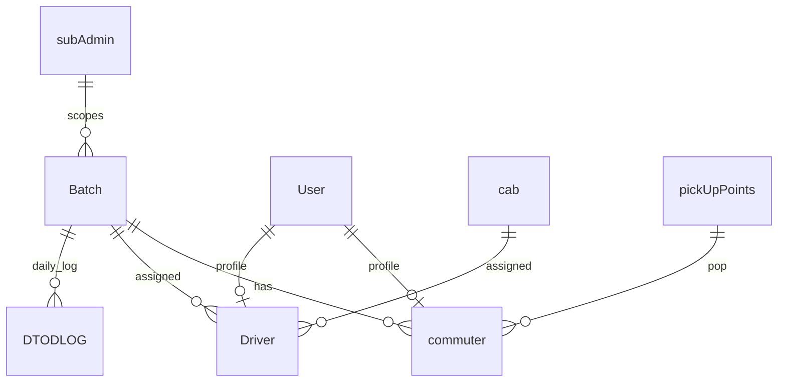

> **Doc:** docs/backend/02-data-model.md
> **Updated:** 2026-08-14 19:55 IST
> **Session:** Auth security wave — public client does not send ADMIN

# Backend — Data Model

## User domain (`user_servcies`)

### User (AUTH_USER_MODEL)

- `mobileNumber` — unique, USERNAME_FIELD
- `userType` — ADMIN | DRIVER | COMMUTER. Flutter **public** sign-up does not send ADMIN. Admin CRUD still posts DRIVER/COMMUTER. Unauthenticated `POST /user/` still trusts the client field (backend follow-up).
- `username`, `address`, `deviceId`, `hasPaid`
- `email` — Django `AbstractUser` EmailField (blank allowed). Flutter **admin commuter form requires it**.
- `address` — `CharField(max_length=100, null=True)`. Flutter: empty **create** copies email (truncated to 100); **update** sends last saved address unless the admin typed a new one. Never persist placeholders `mail@email.com` / `"address"`.
- `PATCH /user/<pk>` is **partial** (`userSerializer`). Admin list serializers omit email/address; edit loads `GET /user/<pk>`.

### subAdmin

- `id` — UUID primary key (= adminCode in URLs)
- `userId` — FK to User

### commuter

- `userId`, `batchId`, `cabId`, `popId`, `adminCode`
- `isComing` — boolean, default True
- `collegeName`

### Driver

- `userId`, `batchId`, `cabId`, `adminCode`
- Unique together: `(batchId, cabId)`

---

## Fleet domain (`cab_services`)

### Routes

- `routeName`, `adminCode`
- Unique: `(routeName, adminCode)`

### Batch

- `batchName`, `batchTime`, `end_time`, `startDate`, `endDate`, `adminCode`
- Flutter maps `end_time` → `returnTime` (display label only)

### pickUpPoints

- `pickUpPointName`, `lat`, `longitude`, `routeId`, `adminCode`, `inLine`

### cab

- `regNumber`, `capacity`, `km`, `routeId`, `adminCode`, `thumbnail`

---

## D2D domain (`d2d_log`)

### DTODLOG

| Field | Type | Purpose |
|-------|------|---------|
| `CList` | ArrayField[int] | **User IDs** picked up (confirmed) |
| `batchId` | FK Batch | Which batch |
| `tripDate` | Date | Day of trip |
| `startTime` | DateTime | auto on create |
| `endTime` | DateTime | set on STOP |
| `isActive` | Boolean | trip running |
| `return_start_time` | Time | **Unused** in code |
| `return_end_time` | Time | **Unused** in code |

**Constraint (Fix 4 — done):** unique `(batchId, tripDate)` — migration `0002_unique_batch_trip_date`.

---

## Redis — two separate key spaces (same Redis server)

Both use the **same Redis container** (`C2S-redis`) but **different keys and purposes**. They do not overwrite each other.

| | Morning live D2D | Evening return batch |
|--|------------------|----------------------|
| **Purpose** | Real-time pickup queue (WebSocket) | Confirmed return riders (REST) |
| **Key pattern** | `d2d:live:2026-08-05:1` | `05-08-2026_1` |
| **Value type** | JSON blob (full DS) | Set of user ID strings |
| **Written by** | WebSocket `connect` / `receive` | `POST add_commuter` |
| **Cleared by** | WS STOP → `delete_live_state` | `POST/GET end/{batch_id}` |
| **Code module** | `d2d_log/live_state.py` | `d2d_log/return_batch_utils.py` |

### What “separate so restarts don’t cross-affect” means

**Not** two Redis servers — **two key namespaces** on one Redis:

1. **Django restart mid–morning trip:** Live queue is in `d2d:live:…` → reconnect restores queue. Return batch key `05-08-2026_1` is untouched.
2. **End return trip:** Deletes only `05-08-2026_1`. Morning `d2d:live:…` (if any) stays until driver STOP.
3. **Morning STOP:** Deletes only `d2d:live:…`. Evening confirmed set stays until admin ends return.

So fixing/storing morning state in Redis does **not** break or reset evening return data, and vice versa.

**Before Fix 2:** Morning live queue lived on `channel_layer` (Python process memory) — lost on restart and unrelated to return Redis. **After Fix 2:** Morning queue is durable in Redis under its **own** key prefix.

---

## Live D2D state (DS) — not a DB table

Runtime JSON shape:

```json
{
  "data": [
    { "4": {
        "pickUpPoint": "Gate A",
        "inLine": 1,
        "mobile_number": "9876543210",
        "username": "John"
    }}
  ],
  "D2D_id": 12,
  "driver": { ... serialized driver ... }
}
```

**Storage (Fix 2 — done):** Redis key `d2d:live:{YYYY-MM-DD}:{batch_id}` via `live_state.py`.

---

## Return batch Redis

| Item | Value |
|------|-------|
| Key | `{dd-mm-yyyy}_{batch_id}` e.g. `05-08-2026_1` |
| Type | Set of **user ID** strings |
| TTL | None (cleared by `/return_batch/end/`) |
| Date source | `timezone.localdate()` (Fix R9) |

Separate from live D2D `d2d:live:…` keys and from DTODLOG.CList.

---

## ID convention (app-wide)

| Context | ID type |
|---------|---------|
| D2D WebSocket CLIST / CList | **User ID** |
| Return batch Redis set members | **User ID** (string) |
| Flutter add/remove body `commuter_id` | **User ID** (`userId.id`) |

---

## Entity relationships (simplified)



---

## Related

- [03-d2d-websocket-lifecycle.md](./03-d2d-websocket-lifecycle.md)
- [04-return-batch-lifecycle.md](./04-return-batch-lifecycle.md)
- [06-planned-fixes.md](./06-planned-fixes.md)
