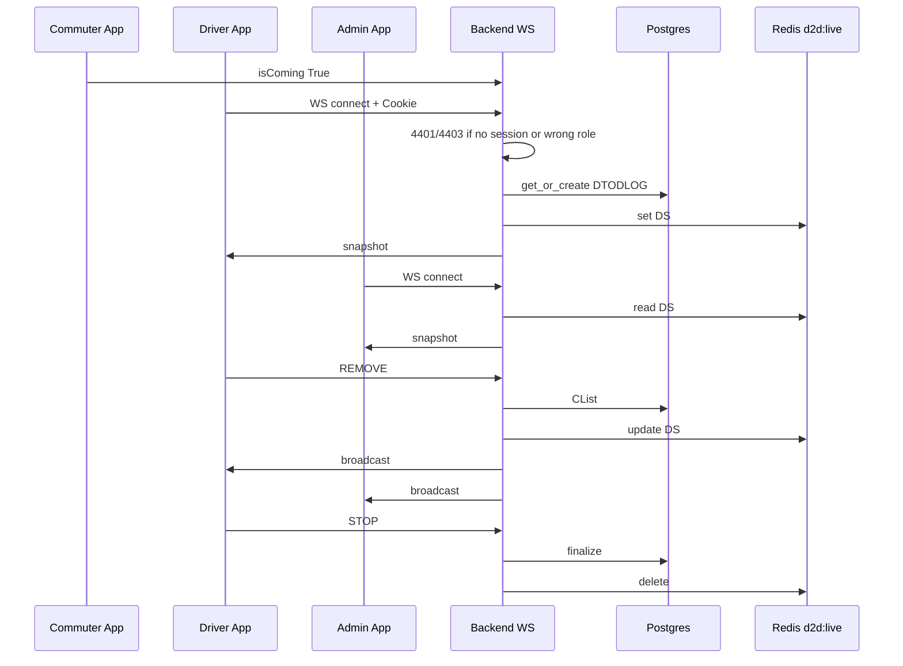

> **Doc:** docs/features/D2D_E2E.md
> **Updated:** 2026-08-17 22:15 IST
> **Session:** Wrap — 2-device STOP UX verified

# Morning D2D Trip (End-to-End)

Full-stack flow for live door-to-door morning pickup. **Status:** Fixes 1, 2, 4 + Flutter ended-trip UI ✅ (Aug 2026).

## Participants

- **Commuter** — sets `isComing=True` in app
- **Admin** — assigns batch, driver, cab, POPs; monitors live trip
- **Driver** — runs live log, confirms pickups, stops trip
- **Backend** — WebSocket consumer + DTODLOG + Redis live DS

---

## Phase 0: Setup (REST, before trip)

| Step | Actor | Backend | Frontend |
|------|-------|---------|----------|
| Create batch | Admin | `POST /cab/batch` | `batch_screen` / forms |
| Assign driver + cab | Admin | `POST /user/` driver payload | `driver_form` |
| Register commuters on batch | Admin | commuter + batchId | `commuter_screen` |
| Mark coming today | Commuter | `PATCH` isComing | `commuter_home_page` toggle |

**State:** DB only. No DTODLOG yet. Running batches count = 0.

---

## Phase 1: Trip start (WebSocket connect)

| Step | Actor | Backend | Frontend |
|------|-------|---------|----------|
| Open live log | Driver | WS `connect()` with session cookie | `D2DLogScreen` → `connect(batchId)` |
| Reject anonymous / wrong role | Backend | Close **4401** / **4403** | error UI, not empty list |
| Create DTODLOG | Backend | `get_or_create(batchId, tripDate)` — this is the DB row; **not** STOP | — |
| Ended log guard | Backend | Close 4001 if already stopped | `isTripEnded` error UI |
| Build live queue | Backend | Redis miss → rebuild from DB → `d2d:live:…` | — |
| Initial snapshot | Backend | `{"result": DS}` | `_handleWebSocketMessage` |
| Running list | Admin REST | `GET running_batches` | Dashboard poll |

**URL:** `ws://<host>/ws/<batch_id>/` (or `wss://`). Handshake includes `Cookie: sessionid=…`.

---

## Phase 2: Admin joins

| Step | Actor | Backend | Frontend |
|------|-------|---------|----------|
| Open channel | Admin | Same WS group | `D2dChannel` → `connect(batchId)` |
| See same queue | Backend | Read DS from Redis | Rebuild UI from payload |

---

## Phase 3: During trip

| Action | Driver UI | Admin UI | WS ACTION | Backend effect |
|--------|-----------|----------|-----------|----------------|
| Confirm pickup | Swipe green | — | REMOVE | CList += userId, Redis DS update |
| Remove from list | Swipe red | Swipe red | DELETE | DS only |
| Add commuter | — | Add sheet (all commuters) | ADD | Lookup by user ID (this batch, then any). Needs POP. Missing row → `invalid_commuter`, socket stays up |
| Call | Phone links | Phone links | — | — |

All mutations broadcast `{"result": DS}` to group.

---

## Phase 4: Trip end

| Step | Actor | Backend | Frontend |
|------|-------|---------|----------|
| STOP | Driver | ACTION STOP | STOP TRIP FAB |
| Finalize log | Backend | isActive=False, endTime, CList → isComing=False | — |
| Broadcast + close | Backend | `{isActive: false, data: []}` then close **4001** | Admin `isTripEnded` + refresh running list |
| Clear live state | Backend | `delete_live_state()` | disconnect |
| Reconnect same day | Backend | Close **4001** | "Trip already ended", no retry; STOP FAB hidden |

---

## Phase 5: Edge cases

| Scenario | Behavior |
|----------|----------|
| Django restart mid-trip | Redis DS restored on reconnect ✅ |
| Driver closes app / admin Close channel without STOP | Trip stays active (by design). Reconnect joins the same `DTODLOG` |
| Reconnect after STOP same day | 4001 + Flutter error ✅ |
| Empty isComing pool | Empty queue / WAITING chip |

---

## Data flow diagram

---

## Key file index

| Layer | Files |
|-------|-------|
| Backend WS | `d2d_log/consumers.py`, `live_state.py` |
| Backend REST | `d2d_log/views.py` (RunningBatches, get_d2d_log_status) |
| Backend test | `d2d_log/test_d2d_fixes.py` |
| Flutter provider | `lib/features/d2d/providers/d2d_channel_provider.dart` |
| Flutter driver | `lib/features/d2d/screens/d2d_log_screen.dart` |
| Flutter admin | `lib/features/d2d/screens/d2d_channel.dart` |
| Contracts | [API_CONTRACTS.md](../API_CONTRACTS.md) |

---

## Related

- [../backend/03-d2d-websocket-lifecycle.md](../backend/03-d2d-websocket-lifecycle.md)
- [../../lib/features/d2d/README.md](../../lib/features/d2d/README.md)
- [RETURN_BATCH_E2E.md](./RETURN_BATCH_E2E.md) — separate evening flow
