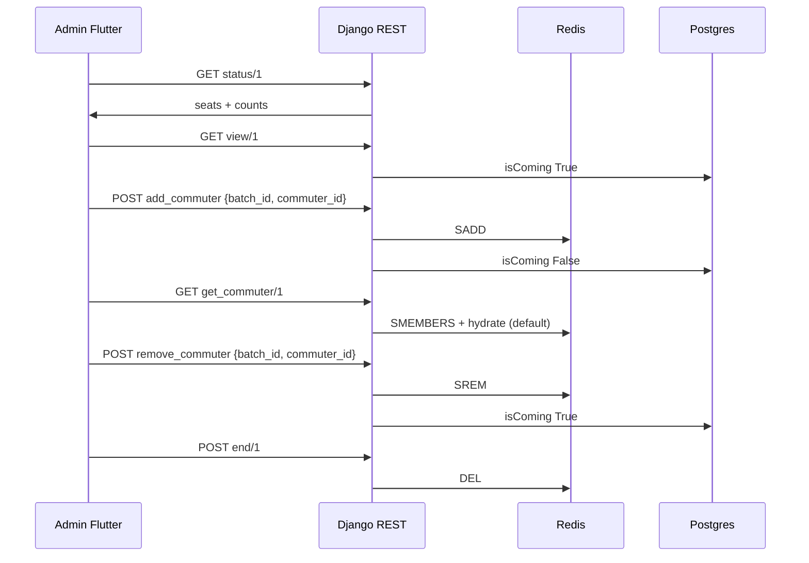

> **Doc:** docs/features/RETURN_BATCH_E2E.md
> **Updated:** 2026-08-19 18:25 IST
> **Session:** M4 Available Home/Overflow; view/ split

# Evening Return Trip (End-to-End)

Full-stack flow for return batch — REST + Redis, **not** WebSocket.

**Status:** ✅ Backend R1–R6 + Flutter admin + driver UI (Aug 2026).

---

## Participants

- **Commuter** — appears on Home if this is their batch and they are on today's CList; Overflow if their home return is later
- **Admin** — confirms return seats (capacity-limited); ends trip
- **Driver** — confirm/remove on `/driverReturnCommuter/:batchId` (no End)
- **Backend** — Redis set + REST under `/d2d/return_batch/`

---

## REST used by the app

Every evening endpoint is called from `ReturnBatchRepositoryImpl`. Contract: [../API_CONTRACTS.md](../API_CONTRACTS.md).

| Call | When |
|------|------|
| `GET …/status/<id>` | Batch picker cards — Available, Seats left (`remaining_capacity`), Confirmed; optional Home hold / Overflow in / Overflow open |
| `GET …/view/<id>` | Available tab — `home[]` then `overflow[]` |
| `GET …/get_commuter/<id>` | Confirmed tab (default hydrate; no query param) |
| `POST …/add_commuter` `{ batch_id, commuter_id }` | Admin or driver Confirm (`commuter_id` = user id, any batch) |
| `POST …/remove_commuter` same body | Admin or driver Remove |
| `POST …/end/<id>` | Admin End FAB (not GET) |

Driver uses the same GET + add/remove POSTs. End stays admin-only.

---

## Phase 1: Select batch

| Step | Frontend | Backend |
|------|----------|---------|
| Open Return Batches | `ReturningBatchScreen` | — |
| Load batch list | `BatchProvider.fetchBatches()` | `GET /cab/batch` |
| Card stats | `ReturnBatchProvider.fetchStatusesForBatches()` | `GET status/{id}` each |
| Navigate | `context.push('/returnCommuterScreen/$batchId')` | — |

---

## Phase 2: Available pool

| Step | Frontend | Backend |
|------|----------|---------|
| Load trip | `loadReturnTrip()` → Available tab | `GET view/{id}` |
| Display | `CommuterModel` from `commuters` array | Org commuters minus today's confirmed IDs |

---

## Phase 3: Confirm (capacity-limited)

| Step | Frontend | Backend |
|------|----------|---------|
| Swipe Confirm | `confirmCommuter(userId.id, batchId)` | `POST add_commuter` |
| Refresh | `loadReturnTrip()` | Redis SADD + `isComing=False` |
| Full cab | SnackBar error | `409 capacity_full` |

---

## Phase 4: Confirmed + capacity

| Step | Frontend | Backend |
|------|----------|---------|
| Confirmed tab + banner | `ReturnBatchProvider.capacity` | `GET get_commuter/{id}` (hydrated `commuters` by default) |
| Names | Parse `commuters` | No `?hydrate=` from client; no ID join |

---

## Phase 5: Remove / end

| Step | Frontend | Backend |
|------|----------|---------|
| Swipe Remove | `removeCommuter(userId.id)` | SREM + **`isComing=True`** |
| End return FAB | Dialog → `endReturnTrip()` | `POST end/{id}` → DEL Redis |
| After end | `Navigator.pop` | `is_active` false on status |

---

## vs Morning D2D

| | Morning D2D | Evening Return |
|--|-------------|----------------|
| Sync | WebSocket | Pull-to-refresh |
| Redis key | `d2d:live:YYYY-MM-DD:id` | `dd-mm-yyyy_id` |
| Flutter transport | `WebSocketChannel` | Dio REST |
| Shared state? | **No** — separate keys |

See [../backend/02-data-model.md](../backend/02-data-model.md).

---

## E2E sequence

---

## Key file index

| Layer | Files |
|-------|-------|
| Backend REST | `d2d_log/return_batch_views.py` |
| Backend logic | `d2d_log/return_batch_utils.py` |
| Backend test | `d2d_log/test_return_batch_fixes.py` |
| Flutter provider | `lib/features/batches/providers/return_batch_provider.dart` |
| Flutter repo | `lib/features/batches/repositories/return_batch_repository_impl.dart` |
| Flutter picker | `lib/features/batches/screens/returning_batch_screen.dart` |
| Flutter list | `lib/features/commuters/screens/return_batch_commuter_screen.dart` |

---

## Related

- [../backend/04-return-batch-lifecycle.md](../backend/04-return-batch-lifecycle.md)
- [../../lib/features/batches/README.md](../../lib/features/batches/README.md)
- [../API_CONTRACTS.md](../API_CONTRACTS.md)
- [D2D_E2E.md](./D2D_E2E.md) — separate morning flow
